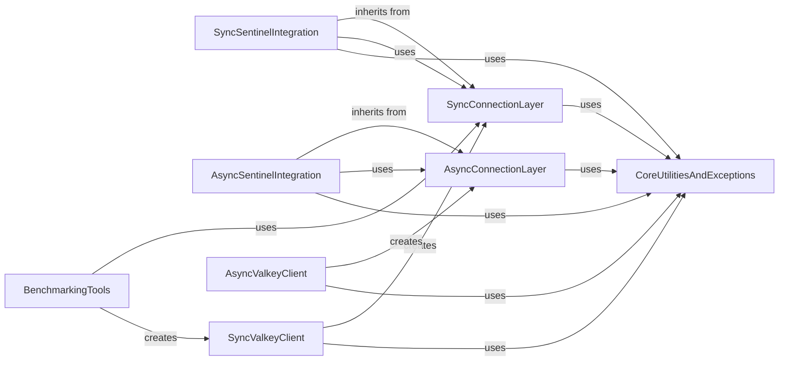

## Component Details

This graph illustrates the architecture of the Connection & Pooling subsystem within the valkey-py library. It is primarily divided into synchronous and asynchronous layers for managing network connections to Valkey servers, including connection pooling, SSL/TLS encryption, and Unix domain socket support. The system also integrates with Valkey Sentinel for high-availability setups and provides core utilities for error handling, retries, and data parsing. The main purpose is to provide robust and efficient mechanisms for establishing and maintaining connections to Valkey, catering to both blocking and non-blocking application requirements.

### SyncConnectionLayer
This component is responsible for managing synchronous network connections to Valkey servers. It provides the foundational classes for establishing, maintaining, and closing connections, handling various connection types (TCP, SSL, Unix Domain Sockets), and managing connection pools for efficient resource utilization. It also includes mechanisms for command serialization and deserialization.

**Related Classes/Methods**:

- <a href="https://github.com/valkey-io/valkey-py/blob/master/valkey/connection.py#L952-L1235" target="_blank" rel="noopener noreferrer">`valkey-py.valkey.connection.ConnectionPool` (952:1235)</a>
- <a href="https://github.com/valkey-io/valkey-py/blob/master/valkey/connection.py#L147-L676" target="_blank" rel="noopener noreferrer">`valkey-py.valkey.connection.AbstractConnection` (147:676)</a>
- <a href="https://github.com/valkey-io/valkey-py/blob/master/valkey/connection.py#L679-L746" target="_blank" rel="noopener noreferrer">`valkey-py.valkey.connection.Connection` (679:746)</a>
- <a href="https://github.com/valkey-io/valkey-py/blob/master/valkey/connection.py#L749-L915" target="_blank" rel="noopener noreferrer">`valkey-py.valkey.connection.SSLConnection` (749:915)</a>
- <a href="https://github.com/valkey-io/valkey-py/blob/master/valkey/connection.py#L918-L946" target="_blank" rel="noopener noreferrer">`valkey-py.valkey.connection.UnixDomainSocketConnection` (918:946)</a>
- <a href="https://github.com/valkey-io/valkey-py/blob/master/valkey/connection.py#L1238-L1395" target="_blank" rel="noopener noreferrer">`valkey-py.valkey.connection.BlockingConnectionPool` (1238:1395)</a>
- <a href="https://github.com/valkey-io/valkey-py/blob/master/valkey/connection.py#L78-L93" target="_blank" rel="noopener noreferrer">`valkey-py.valkey.connection.LibvalkeyRespSerializer` (78:93)</a>
- <a href="https://github.com/valkey-io/valkey-py/blob/master/valkey/connection.py#L96-L144" target="_blank" rel="noopener noreferrer">`valkey-py.valkey.connection.PythonRespSerializer` (96:144)</a>

### AsyncConnectionLayer
This component mirrors the synchronous connection layer but is designed for asynchronous operations using asyncio. It handles non-blocking network connections, including various connection types and asynchronous connection pooling, ensuring efficient I/O for concurrent Valkey interactions.

**Related Classes/Methods**:

- <a href="https://github.com/valkey-io/valkey-py/blob/master/valkey/asyncio/connection.py#L969-L1174" target="_blank" rel="noopener noreferrer">`valkey-py.valkey.asyncio.connection.ConnectionPool` (969:1174)</a>
- <a href="https://github.com/valkey-io/valkey-py/blob/master/valkey/asyncio/connection.py#L99-L745" target="_blank" rel="noopener noreferrer">`valkey-py.valkey.asyncio.connection.AbstractConnection` (99:745)</a>
- <a href="https://github.com/valkey-io/valkey-py/blob/master/valkey/asyncio/connection.py#L748-L802" target="_blank" rel="noopener noreferrer">`valkey-py.valkey.asyncio.connection.Connection` (748:802)</a>
- <a href="https://github.com/valkey-io/valkey-py/blob/master/valkey/asyncio/connection.py#L805-L866" target="_blank" rel="noopener noreferrer">`valkey-py.valkey.asyncio.connection.SSLConnection` (805:866)</a>
- <a href="https://github.com/valkey-io/valkey-py/blob/master/valkey/asyncio/connection.py#L932-L953" target="_blank" rel="noopener noreferrer">`valkey-py.valkey.asyncio.connection.UnixDomainSocketConnection` (932:953)</a>
- <a href="https://github.com/valkey-io/valkey-py/blob/master/valkey/asyncio/connection.py#L1177-L1249" target="_blank" rel="noopener noreferrer">`valkey-py.valkey.asyncio.connection.BlockingConnectionPool` (1177:1249)</a>
- <a href="https://github.com/valkey-io/valkey-py/blob/master/valkey/asyncio/connection.py#L869-L929" target="_blank" rel="noopener noreferrer">`valkey-py.valkey.asyncio.connection.ValkeySSLContext` (869:929)</a>

### SyncSentinelIntegration
This component provides synchronous support for Valkey Sentinel, enabling the client to discover and connect to master and replica instances in a high-availability setup. It includes managed connections and connection pools that interact with Sentinel to get the correct server addresses.

**Related Classes/Methods**:

- <a href="https://github.com/valkey-io/valkey-py/blob/master/valkey/sentinel.py#L25-L87" target="_blank" rel="noopener noreferrer">`valkey-py.valkey.sentinel.SentinelManagedConnection` (25:87)</a>
- <a href="https://github.com/valkey-io/valkey-py/blob/master/valkey/sentinel.py#L142-L200" target="_blank" rel="noopener noreferrer">`valkey-py.valkey.sentinel.SentinelConnectionPool` (142:200)</a>
- <a href="https://github.com/valkey-io/valkey-py/blob/master/valkey/sentinel.py#L94-L139" target="_blank" rel="noopener noreferrer">`valkey-py.valkey.sentinel.SentinelConnectionPoolProxy` (94:139)</a>

### AsyncSentinelIntegration
This component offers asynchronous support for Valkey Sentinel, allowing the client to interact with Sentinel in a non-blocking manner for master/replica discovery and failover handling.

**Related Classes/Methods**:

- <a href="https://github.com/valkey-io/valkey-py/blob/master/valkey/asyncio/sentinel.py#L31-L98" target="_blank" rel="noopener noreferrer">`valkey-py.valkey.asyncio.sentinel.SentinelManagedConnection` (31:98)</a>
- <a href="https://github.com/valkey-io/valkey-py/blob/master/valkey/asyncio/sentinel.py#L105-L173" target="_blank" rel="noopener noreferrer">`valkey-py.valkey.asyncio.sentinel.SentinelConnectionPool` (105:173)</a>
- <a href="https://github.com/valkey-io/valkey-py/blob/master/valkey/asyncio/sentinel.py#L27-L28" target="_blank" rel="noopener noreferrer">`valkey-py.valkey.asyncio.sentinel.SlaveNotFoundError` (27:28)</a>

### SyncValkeyClient
This is the primary synchronous interface for users to interact with Valkey. It provides methods for executing Valkey commands and manages the underlying synchronous connection pool.

**Related Classes/Methods**:

- <a href="https://github.com/valkey-io/valkey-py/blob/master/valkey/client.py#L92-L619" target="_blank" rel="noopener noreferrer">`valkey-py.valkey.client.Valkey` (92:619)</a>
- <a href="https://github.com/valkey-io/valkey-py/blob/master/valkey/client.py#L61-L85" target="_blank" rel="noopener noreferrer">`valkey-py.valkey.client.CaseInsensitiveDict` (61:85)</a>

### AsyncValkeyClient
This is the primary asynchronous interface for users to interact with Valkey. It provides methods for executing Valkey commands and manages the underlying asynchronous connection pool.

**Related Classes/Methods**:

- <a href="https://github.com/valkey-io/valkey-py/blob/master/valkey/asyncio/client.py#L101-L694" target="_blank" rel="noopener noreferrer">`valkey-py.valkey.asyncio.client.Valkey` (101:694)</a>

### CoreUtilitiesAndExceptions
This component encapsulates common utility functions, error handling classes, retry mechanisms, and backoff strategies used throughout the valkey-py library. It provides foundational support for various operations, including string/bytes conversions, error formatting, and robust command execution.

**Related Classes/Methods**:

- `valkey-py.valkey.utils` (full file reference)
- `valkey-py.valkey.exceptions` (full file reference)
- <a href="https://github.com/valkey-io/valkey-py/blob/master/valkey/retry.py#L13-L70" target="_blank" rel="noopener noreferrer">`valkey-py.valkey.retry.Retry` (13:70)</a>
- <a href="https://github.com/valkey-io/valkey-py/blob/master/valkey/backoff.py#L38-L42" target="_blank" rel="noopener noreferrer">`valkey-py.valkey.backoff.NoBackoff` (38:42)</a>
- <a href="https://github.com/valkey-io/valkey-py/blob/master/valkey/_parsers/encoders.py#L4-L44" target="_blank" rel="noopener noreferrer">`valkey-py.valkey._parsers.encoders.Encoder` (4:44)</a>
- <a href="https://github.com/valkey-io/valkey-py/blob/master/valkey/_parsers/url_parser.py#L41-L104" target="_blank" rel="noopener noreferrer">`valkey-py.valkey._parsers.url_parser.parse_url` (41:104)</a>
- <a href="https://github.com/valkey-io/valkey-py/blob/master/valkey/_cache.py#L199-L385" target="_blank" rel="noopener noreferrer">`valkey-py.valkey._cache._LocalCache` (199:385)</a>
- <a href="https://github.com/valkey-io/valkey-py/blob/master/valkey/credentials.py#L13-L26" target="_blank" rel="noopener noreferrer">`valkey-py.valkey.credentials.UsernamePasswordCredentialProvider` (13:26)</a>
- <a href="https://github.com/valkey-io/valkey-py/blob/master/valkey/ocsp.py#L169-L307" target="_blank" rel="noopener noreferrer">`valkey-py.valkey.ocsp.OCSPVerifier` (169:307)</a>

### BenchmarkingTools
This component contains classes and methods specifically designed for benchmarking the performance of different aspects of the valkey-py library, such as command packing and connection handling.

**Related Classes/Methods**:

- <a href="https://github.com/valkey-io/valkey-py/blob/master/benchmarks/command_packer_benchmark.py#L6-L37" target="_blank" rel="noopener noreferrer">`valkey-py.benchmarks.command_packer_benchmark.StringJoiningConnection` (6:37)</a>
- <a href="https://github.com/valkey-io/valkey-py/blob/master/benchmarks/command_packer_benchmark.py#L40-L77" target="_blank" rel="noopener noreferrer">`valkey-py.benchmarks.command_packer_benchmark.ListJoiningConnection` (40:77)</a>
- <a href="https://github.com/valkey-io/valkey-py/blob/master/benchmarks/base.py#L9-L44" target="_blank" rel="noopener noreferrer">`valkey-py.benchmarks.base.Benchmark` (9:44)</a>

### [FAQ](https://github.com/CodeBoarding/GeneratedOnBoardings/tree/main?tab=readme-ov-file#faq)