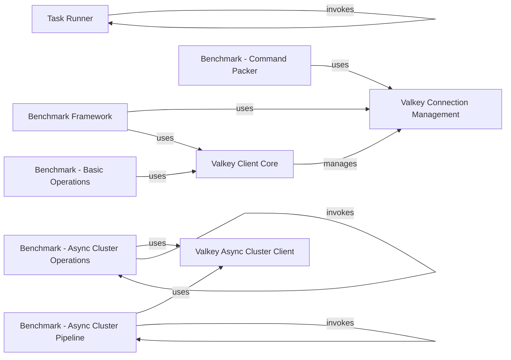

## Component Details

This graph provides an overview of the 'Development & Testing Utilities' subsystem within the valkey-py project. It details components responsible for benchmarking Valkey operations and managing high-level development tasks such as environment setup, linting, and test execution. The relationships illustrate how these components interact to achieve their respective functionalities.

### Task Runner
This component is responsible for orchestrating various development and testing tasks within the valkey-py project. It includes functionalities for cleaning the environment, running linters, and executing different sets of tests (standalone and cluster).

**Related Classes/Methods**:

- <a href="https://github.com/valkey-io/valkey-py/blob/master/tasks.py#L13-L17" target="_blank" rel="noopener noreferrer">`valkey-py.tasks:devenv` (13:17)</a>
- <a href="https://github.com/valkey-io/valkey-py/blob/master/tasks.py#L38-L41" target="_blank" rel="noopener noreferrer">`valkey-py.tasks:all_tests` (38:41)</a>
- <a href="https://github.com/valkey-io/valkey-py/blob/master/tasks.py#L45-L51" target="_blank" rel="noopener noreferrer">`valkey-py.tasks:tests` (45:51)</a>
- <a href="https://github.com/valkey-io/valkey-py/blob/master/tasks.py#L82-L88" target="_blank" rel="noopener noreferrer">`valkey-py.tasks.clean` (82:88)</a>
- <a href="https://github.com/valkey-io/valkey-py/blob/master/tasks.py#L28-L34" target="_blank" rel="noopener noreferrer">`valkey-py.tasks.linters` (28:34)</a>
- <a href="https://github.com/valkey-io/valkey-py/blob/master/tasks.py#L55-L64" target="_blank" rel="noopener noreferrer">`valkey-py.tasks.standalone_tests` (55:64)</a>
- <a href="https://github.com/valkey-io/valkey-py/blob/master/tasks.py#L68-L78" target="_blank" rel="noopener noreferrer">`valkey-py.tasks.cluster_tests` (68:78)</a>

### Valkey Client Core
The Valkey Client Core provides the primary interface for interacting with a Valkey server. It encapsulates the logic for sending commands, parsing responses, and managing connections. It also includes functionalities for Pub/Sub messaging, monitoring, and transactional pipelines.

**Related Classes/Methods**:

- <a href="https://github.com/valkey-io/valkey-py/blob/master/valkey/client.py#L92-L619" target="_blank" rel="noopener noreferrer">`valkey.client.Valkey` (92:619)</a>
- <a href="https://github.com/valkey-io/valkey-py/blob/master/valkey/client.py#L88-L89" target="_blank" rel="noopener noreferrer">`valkey.client.AbstractValkey` (88:89)</a>
- <a href="https://github.com/valkey-io/valkey-py/blob/master/valkey/client.py#L625-L689" target="_blank" rel="noopener noreferrer">`valkey.client.Monitor` (625:689)</a>
- <a href="https://github.com/valkey-io/valkey-py/blob/master/valkey/client.py#L692-L1182" target="_blank" rel="noopener noreferrer">`valkey.client.PubSub` (692:1182)</a>
- <a href="https://github.com/valkey-io/valkey-py/blob/master/valkey/client.py#L1224-L1569" target="_blank" rel="noopener noreferrer">`valkey.client.Pipeline` (1224:1569)</a>

### Valkey Connection Management
This component handles the establishment, management, and pooling of connections to Valkey servers. It provides different connection types (TCP, SSL, Unix Domain Socket) and mechanisms for connection health checks and retries.

**Related Classes/Methods**:

- <a href="https://github.com/valkey-io/valkey-py/blob/master/valkey/connection.py#L952-L1235" target="_blank" rel="noopener noreferrer">`valkey.connection.ConnectionPool` (952:1235)</a>
- <a href="https://github.com/valkey-io/valkey-py/blob/master/valkey/connection.py#L147-L676" target="_blank" rel="noopener noreferrer">`valkey.connection.AbstractConnection` (147:676)</a>
- <a href="https://github.com/valkey-io/valkey-py/blob/master/valkey/connection.py#L749-L915" target="_blank" rel="noopener noreferrer">`valkey.connection.SSLConnection` (749:915)</a>
- <a href="https://github.com/valkey-io/valkey-py/blob/master/valkey/connection.py#L918-L946" target="_blank" rel="noopener noreferrer">`valkey.connection.UnixDomainSocketConnection` (918:946)</a>

### Valkey Async Cluster Client
This component provides an asynchronous client for interacting with a Valkey cluster, enabling non-blocking operations for improved performance in concurrent environments.

**Related Classes/Methods**:

- <a href="https://github.com/valkey-io/valkey-py/blob/master/valkey/asyncio/cluster.py#L99-L959" target="_blank" rel="noopener noreferrer">`valkey.asyncio.cluster.ValkeyCluster` (99:959)</a>

### Benchmark Framework
This component provides a foundational framework for creating and running performance benchmarks against Valkey. It includes a base class for benchmarks and utilities for client acquisition.

**Related Classes/Methods**:

- <a href="https://github.com/valkey-io/valkey-py/blob/master/benchmarks/base.py#L9-L44" target="_blank" rel="noopener noreferrer">`valkey-py.benchmarks.base.Benchmark` (9:44)</a>
- <a href="https://github.com/valkey-io/valkey-py/blob/master/benchmarks/base.py#L15-L23" target="_blank" rel="noopener noreferrer">`valkey-py.benchmarks.base.Benchmark:get_client` (15:23)</a>

### Benchmark - Basic Operations
This component focuses on benchmarking the performance of fundamental Valkey operations such as setting and getting strings and integers, incrementing values, and list operations.

**Related Classes/Methods**:

- `valkey-py.benchmarks.basic_operations` (full file reference)
- <a href="https://github.com/valkey-io/valkey-py/blob/master/benchmarks/basic_operations.py#L30-L42" target="_blank" rel="noopener noreferrer">`valkey-py.benchmarks.basic_operations:run` (30:42)</a>
- <a href="https://github.com/valkey-io/valkey-py/blob/master/benchmarks/basic_operations.py#L8-L27" target="_blank" rel="noopener noreferrer">`valkey-py.benchmarks.basic_operations.parse_args` (8:27)</a>
- <a href="https://github.com/valkey-io/valkey-py/blob/master/benchmarks/basic_operations.py#L65-L76" target="_blank" rel="noopener noreferrer">`valkey-py.benchmarks.basic_operations.set_str` (65:76)</a>
- <a href="https://github.com/valkey-io/valkey-py/blob/master/benchmarks/basic_operations.py#L80-L91" target="_blank" rel="noopener noreferrer">`valkey-py.benchmarks.basic_operations.set_int` (80:91)</a>
- <a href="https://github.com/valkey-io/valkey-py/blob/master/benchmarks/basic_operations.py#L95-L105" target="_blank" rel="noopener noreferrer">`valkey-py.benchmarks.basic_operations.get_str` (95:105)</a>
- <a href="https://github.com/valkey-io/valkey-py/blob/master/benchmarks/basic_operations.py#L109-L119" target="_blank" rel="noopener noreferrer">`valkey-py.benchmarks.basic_operations.get_int` (109:119)</a>
- <a href="https://github.com/valkey-io/valkey-py/blob/master/benchmarks/basic_operations.py#L123-L133" target="_blank" rel="noopener noreferrer">`valkey-py.benchmarks.basic_operations.incr` (123:133)</a>
- <a href="https://github.com/valkey-io/valkey-py/blob/master/benchmarks/basic_operations.py#L137-L148" target="_blank" rel="noopener noreferrer">`valkey-py.benchmarks.basic_operations.lpush` (137:148)</a>
- <a href="https://github.com/valkey-io/valkey-py/blob/master/benchmarks/basic_operations.py#L152-L162" target="_blank" rel="noopener noreferrer">`valkey-py.benchmarks.basic_operations.lrange_300` (152:162)</a>
- <a href="https://github.com/valkey-io/valkey-py/blob/master/benchmarks/basic_operations.py#L166-L174" target="_blank" rel="noopener noreferrer">`valkey-py.benchmarks.basic_operations.lpop` (166:174)</a>
- <a href="https://github.com/valkey-io/valkey-py/blob/master/benchmarks/basic_operations.py#L178-L189" target="_blank" rel="noopener noreferrer">`valkey-py.benchmarks.basic_operations.hmset` (178:189)</a>

### Benchmark - Command Packer
This component benchmarks different strategies for packing commands before sending them to the Valkey server, specifically comparing string joining and list joining methods for command serialization.

**Related Classes/Methods**:

- <a href="https://github.com/valkey-io/valkey-py/blob/master/benchmarks/command_packer_benchmark.py#L6-L37" target="_blank" rel="noopener noreferrer">`valkey-py.benchmarks.command_packer_benchmark.StringJoiningConnection` (6:37)</a>
- <a href="https://github.com/valkey-io/valkey-py/blob/master/benchmarks/command_packer_benchmark.py#L7-L22" target="_blank" rel="noopener noreferrer">`valkey-py.benchmarks.command_packer_benchmark.StringJoiningConnection:send_packed_command` (7:22)</a>
- <a href="https://github.com/valkey-io/valkey-py/blob/master/benchmarks/command_packer_benchmark.py#L40-L77" target="_blank" rel="noopener noreferrer">`valkey-py.benchmarks.command_packer_benchmark.ListJoiningConnection` (40:77)</a>
- <a href="https://github.com/valkey-io/valkey-py/blob/master/benchmarks/command_packer_benchmark.py#L41-L58" target="_blank" rel="noopener noreferrer">`valkey-py.benchmarks.command_packer_benchmark.ListJoiningConnection:send_packed_command` (41:58)</a>

### Benchmark - Async Cluster Operations
This component benchmarks various asynchronous operations on a Valkey cluster, including setting and getting different data types, hash operations, and list operations, to evaluate the performance of the asynchronous cluster client.

**Related Classes/Methods**:

- `valkey-py.benchmarks.cluster_async` (full file reference)
- <a href="https://github.com/valkey-io/valkey-py/blob/master/benchmarks/cluster_async.py#L169-L201" target="_blank" rel="noopener noreferrer">`valkey-py.benchmarks.cluster_async:run` (169:201)</a>
- <a href="https://github.com/valkey-io/valkey-py/blob/master/benchmarks/cluster_async.py#L204-L244" target="_blank" rel="noopener noreferrer">`valkey-py.benchmarks.cluster_async:main` (204:244)</a>
- <a href="https://github.com/valkey-io/valkey-py/blob/master/benchmarks/cluster_async.py#L162-L165" target="_blank" rel="noopener noreferrer">`valkey-py.benchmarks.cluster_async.warmup` (162:165)</a>
- <a href="https://github.com/valkey-io/valkey-py/blob/master/benchmarks/cluster_async.py#L24-L35" target="_blank" rel="noopener noreferrer">`valkey-py.benchmarks.cluster_async.set_str` (24:35)</a>
- <a href="https://github.com/valkey-io/valkey-py/blob/master/benchmarks/cluster_async.py#L39-L50" target="_blank" rel="noopener noreferrer">`valkey-py.benchmarks.cluster_async.set_int` (39:50)</a>
- <a href="https://github.com/valkey-io/valkey-py/blob/master/benchmarks/cluster_async.py#L78-L89" target="_blank" rel="noopener noreferrer">`valkey-py.benchmarks.cluster_async.hset` (78:89)</a>
- <a href="https://github.com/valkey-io/valkey-py/blob/master/benchmarks/cluster_async.py#L108-L116" target="_blank" rel="noopener noreferrer">`valkey-py.benchmarks.cluster_async.incr` (108:116)</a>
- <a href="https://github.com/valkey-io/valkey-py/blob/master/benchmarks/cluster_async.py#L120-L131" target="_blank" rel="noopener noreferrer">`valkey-py.benchmarks.cluster_async.lpush` (120:131)</a>
- <a href="https://github.com/valkey-io/valkey-py/blob/master/benchmarks/cluster_async.py#L54-L62" target="_blank" rel="noopener noreferrer">`valkey-py.benchmarks.cluster_async.get_str` (54:62)</a>
- <a href="https://github.com/valkey-io/valkey-py/blob/master/benchmarks/cluster_async.py#L66-L74" target="_blank" rel="noopener noreferrer">`valkey-py.benchmarks.cluster_async.get_int` (66:74)</a>
- <a href="https://github.com/valkey-io/valkey-py/blob/master/benchmarks/cluster_async.py#L93-L104" target="_blank" rel="noopener noreferrer">`valkey-py.benchmarks.cluster_async.hget` (93:104)</a>
- <a href="https://github.com/valkey-io/valkey-py/blob/master/benchmarks/cluster_async.py#L135-L146" target="_blank" rel="noopener noreferrer">`valkey-py.benchmarks.cluster_async.lrange_300` (135:146)</a>
- <a href="https://github.com/valkey-io/valkey-py/blob/master/benchmarks/cluster_async.py#L150-L158" target="_blank" rel="noopener noreferrer">`valkey-py.benchmarks.cluster_async.lpop` (150:158)</a>

### Benchmark - Async Cluster Pipeline
This component specifically benchmarks asynchronous pipeline operations on a Valkey cluster, assessing the efficiency of batching multiple commands for execution.

**Related Classes/Methods**:

- `valkey-py.benchmarks.cluster_async_pipeline` (full file reference)
- <a href="https://github.com/valkey-io/valkey-py/blob/master/benchmarks/cluster_async_pipeline.py#L52-L92" target="_blank" rel="noopener noreferrer">`valkey-py.benchmarks.cluster_async_pipeline:main` (52:92)</a>
- <a href="https://github.com/valkey-io/valkey-py/blob/master/benchmarks/cluster_async_pipeline.py#L24-L27" target="_blank" rel="noopener noreferrer">`valkey-py.benchmarks.cluster_async_pipeline.warmup` (24:27)</a>
- <a href="https://github.com/valkey-io/valkey-py/blob/master/benchmarks/cluster_async_pipeline.py#L31-L49" target="_blank" rel="noopener noreferrer">`valkey-py.benchmarks.cluster_async_pipeline.run` (31:49)</a>

### [FAQ](https://github.com/CodeBoarding/GeneratedOnBoardings/tree/main?tab=readme-ov-file#faq)