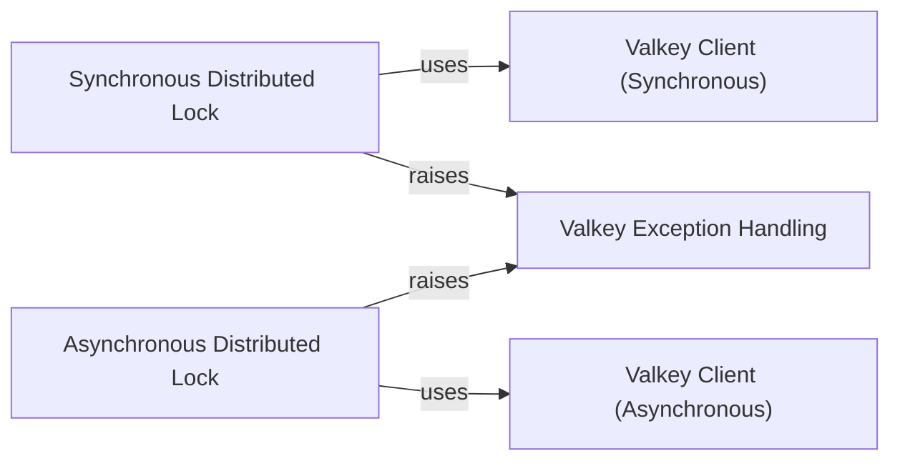

## Component Details

The Distributed Locking subsystem in valkey-py provides mechanisms for managing concurrent access to resources across multiple clients in a distributed environment, ensuring atomicity and consistency. It offers both synchronous and asynchronous lock implementations, leveraging Valkey's capabilities for atomic operations through Lua scripting. The core functionality relies on direct interaction with the Valkey server via dedicated client components and handles specific error conditions through a custom exception framework.

### Synchronous Distributed Lock
Manages distributed locks in a synchronous Python environment, providing methods for acquiring, releasing, extending, and reacquiring locks. It leverages Valkey's scripting for atomic operations and ensures thread-local token management.

**Related Classes/Methods**:

- <a href="https://github.com/valkey-io/valkey-py/blob/master/valkey/lock.py#L11-L325" target="_blank" rel="noopener noreferrer">`valkey.lock.Lock` (11:325)</a>
- <a href="https://github.com/valkey-io/valkey-py/blob/master/valkey/lock.py#L76-L145" target="_blank" rel="noopener noreferrer">`valkey.lock.Lock:__init__` (76:145)</a>
- <a href="https://github.com/valkey-io/valkey-py/blob/master/valkey/lock.py#L157-L163" target="_blank" rel="noopener noreferrer">`valkey.lock.Lock:__enter__` (157:163)</a>
- <a href="https://github.com/valkey-io/valkey-py/blob/master/valkey/lock.py#L165-L171" target="_blank" rel="noopener noreferrer">`valkey.lock.Lock:__exit__` (165:171)</a>
- <a href="https://github.com/valkey-io/valkey-py/blob/master/valkey/lock.py#L173-L218" target="_blank" rel="noopener noreferrer">`valkey.lock.Lock:acquire` (173:218)</a>
- <a href="https://github.com/valkey-io/valkey-py/blob/master/valkey/lock.py#L248-L256" target="_blank" rel="noopener noreferrer">`valkey.lock.Lock:release` (248:256)</a>
- <a href="https://github.com/valkey-io/valkey-py/blob/master/valkey/lock.py#L269-L284" target="_blank" rel="noopener noreferrer">`valkey.lock.Lock:extend` (269:284)</a>
- <a href="https://github.com/valkey-io/valkey-py/blob/master/valkey/lock.py#L301-L312" target="_blank" rel="noopener noreferrer">`valkey.lock.Lock:reacquire` (301:312)</a>
- <a href="https://github.com/valkey-io/valkey-py/blob/master/valkey/lock.py#L147-L155" target="_blank" rel="noopener noreferrer">`valkey.lock.Lock:register_scripts` (147:155)</a>
- <a href="https://github.com/valkey-io/valkey-py/blob/master/valkey/lock.py#L230-L234" target="_blank" rel="noopener noreferrer">`valkey.lock.Lock:locked` (230:234)</a>
- <a href="https://github.com/valkey-io/valkey-py/blob/master/valkey/lock.py#L236-L246" target="_blank" rel="noopener noreferrer">`valkey.lock.Lock:owned` (236:246)</a>
- <a href="https://github.com/valkey-io/valkey-py/blob/master/valkey/lock.py#L24-L29" target="_blank" rel="noopener noreferrer">`valkey.lock.Lock.LUA_RELEASE_SCRIPT` (24:29)</a>
- <a href="https://github.com/valkey-io/valkey-py/blob/master/valkey/lock.py#L33-L52" target="_blank" rel="noopener noreferrer">`valkey.lock.Lock.LUA_EXTEND_SCRIPT` (33:52)</a>
- <a href="https://github.com/valkey-io/valkey-py/blob/master/valkey/lock.py#L56-L61" target="_blank" rel="noopener noreferrer">`valkey.lock.Lock.LUA_REACQUIRE_SCRIPT` (56:61)</a>

### Asynchronous Distributed Lock
Manages distributed locks in an asynchronous Python (asyncio) environment, providing non-blocking methods for lock acquisition, release, extension, and reacquisition. It integrates with Python's asyncio framework and leverages Valkey's scripting.

**Related Classes/Methods**:

- <a href="https://github.com/valkey-io/valkey-py/blob/master/valkey/asyncio/lock.py#L13-L313" target="_blank" rel="noopener noreferrer">`valkey.asyncio.lock.Lock` (13:313)</a>
- <a href="https://github.com/valkey-io/valkey-py/blob/master/valkey/asyncio/lock.py#L78-L147" target="_blank" rel="noopener noreferrer">`valkey.asyncio.lock.Lock:__init__` (78:147)</a>
- <a href="https://github.com/valkey-io/valkey-py/blob/master/valkey/asyncio/lock.py#L159-L162" target="_blank" rel="noopener noreferrer">`valkey.asyncio.lock.Lock:__aenter__` (159:162)</a>
- <a href="https://github.com/valkey-io/valkey-py/blob/master/valkey/asyncio/lock.py#L164-L165" target="_blank" rel="noopener noreferrer">`valkey.asyncio.lock.Lock:__aexit__` (164:165)</a>
- <a href="https://github.com/valkey-io/valkey-py/blob/master/valkey/asyncio/lock.py#L167-L214" target="_blank" rel="noopener noreferrer">`valkey.asyncio.lock.Lock:acquire` (167:214)</a>
- <a href="https://github.com/valkey-io/valkey-py/blob/master/valkey/asyncio/lock.py#L248-L254" target="_blank" rel="noopener noreferrer">`valkey.asyncio.lock.Lock:release` (248:254)</a>
- <a href="https://github.com/valkey-io/valkey-py/blob/master/valkey/asyncio/lock.py#L264-L281" target="_blank" rel="noopener noreferrer">`valkey.asyncio.lock.Lock:extend` (264:281)</a>
- <a href="https://github.com/valkey-io/valkey-py/blob/master/valkey/asyncio/lock.py#L295-L303" target="_blank" rel="noopener noreferrer">`valkey.asyncio.lock.Lock:reacquire` (295:303)</a>
- <a href="https://github.com/valkey-io/valkey-py/blob/master/valkey/asyncio/lock.py#L149-L157" target="_blank" rel="noopener noreferrer">`valkey.asyncio.lock.Lock:register_scripts` (149:157)</a>
- <a href="https://github.com/valkey-io/valkey-py/blob/master/valkey/asyncio/lock.py#L226-L230" target="_blank" rel="noopener noreferrer">`valkey.asyncio.lock.Lock:locked` (226:230)</a>
- <a href="https://github.com/valkey-io/valkey-py/blob/master/valkey/asyncio/lock.py#L232-L246" target="_blank" rel="noopener noreferrer">`valkey.asyncio.lock.Lock:owned` (232:246)</a>
- `valkey.asyncio.lock.Lock.LUA_RELEASE_SCRIPT` (full file reference)
- `valkey.asyncio.lock.Lock.LUA_EXTEND_SCRIPT` (full file reference)
- `valkey.asyncio.lock.Lock.LUA_REACQUIRE_SCRIPT` (full file reference)

### Valkey Client (Synchronous)
Provides the fundamental synchronous client functionalities for interacting with the Valkey server, including executing commands and managing connections. The synchronous distributed lock component relies on this core for all Valkey operations.

**Related Classes/Methods**:

- <a href="https://github.com/valkey-io/valkey-py/blob/master/valkey/client.py#L92-L619" target="_blank" rel="noopener noreferrer">`valkey.client.Valkey` (92:619)</a>
- `valkey.client.Valkey:register_script` (full file reference)

### Valkey Client (Asynchronous)
Provides the fundamental asynchronous client functionalities for interacting with the Valkey server, including executing commands and managing connections. The asynchronous distributed lock component relies on this core for all Valkey operations.

**Related Classes/Methods**:

- <a href="https://github.com/valkey-io/valkey-py/blob/master/valkey/asyncio/client.py#L101-L694" target="_blank" rel="noopener noreferrer">`valkey.asyncio.client.Valkey` (101:694)</a>
- `valkey.asyncio.client.Valkey:register_script` (full file reference)

### Valkey Exception Handling
Defines and manages custom exception types used across the Valkey client library, specifically for signaling errors related to distributed lock operations such as acquisition failures or ownership issues.

**Related Classes/Methods**:

- <a href="https://github.com/valkey-io/valkey-py/blob/master/valkey/exceptions.py#L80-L88" target="_blank" rel="noopener noreferrer">`valkey.exceptions.LockError` (80:88)</a>
- <a href="https://github.com/valkey-io/valkey-py/blob/master/valkey/exceptions.py#L91-L94" target="_blank" rel="noopener noreferrer">`valkey.exceptions.LockNotOwnedError` (91:94)</a>

### [FAQ](https://github.com/CodeBoarding/GeneratedOnBoardings/tree/main?tab=readme-ov-file#faq)