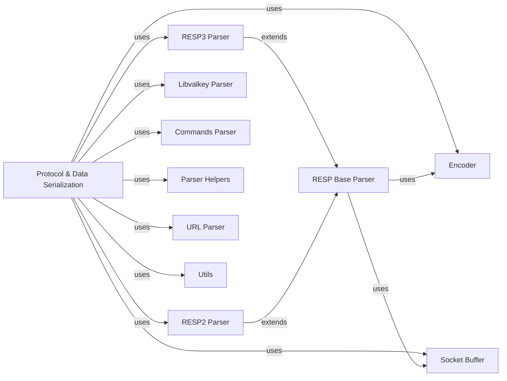

## Component Details

The `Protocol & Data Serialization` component is central to the `valkey-py` library, handling the fundamental aspects of communication with a Valkey server. Its main purpose is to encode Python commands into the Valkey protocol format (RESP2 or RESP3) for transmission and to decode the raw responses received from the server back into usable Python data structures. This involves managing low-level socket buffer operations for efficient data transfer and parsing connection URLs to configure the client. The flow generally starts with an `Encoder` preparing commands, which are then sent over a socket managed by `SocketBuffer`. Responses are read from the `SocketBuffer` and processed by either a `RESP2 Parser`, `RESP3 Parser`, or `Libvalkey Parser` (if available), all of which extend a `RESP Base Parser`. Additionally, `Commands Parser` helps in understanding command structures for routing in cluster environments, and `Parser Helpers` provide specialized parsing for various Valkey command outputs. The `URL Parser` assists in setting up connections from URLs, and `Utils` provides general helper functions.

### Protocol & Data Serialization
Responsible for encoding commands into the Valkey protocol format (RESP2, RESP3) and decoding responses received from the Valkey server. It also handles low-level socket buffer operations and URL parsing for connection strings.

**Related Classes/Methods**:

- <a href="https://github.com/valkey-io/valkey-py/blob/master/valkey/_parsers/encoders.py#L4-L44" target="_blank" rel="noopener noreferrer">`valkey-py.valkey._parsers.encoders.Encoder` (4:44)</a>
- <a href="https://github.com/valkey-io/valkey-py/blob/master/valkey/_parsers/socket.py#L29-L162" target="_blank" rel="noopener noreferrer">`valkey-py.valkey._parsers.socket.SocketBuffer` (29:162)</a>
- <a href="https://github.com/valkey-io/valkey-py/blob/master/valkey/_parsers/resp3.py#L12-L142" target="_blank" rel="noopener noreferrer">`valkey-py.valkey._parsers.resp3._RESP3Parser` (12:142)</a>
- <a href="https://github.com/valkey-io/valkey-py/blob/master/valkey/_parsers/resp2.py#L9-L68" target="_blank" rel="noopener noreferrer">`valkey-py.valkey._parsers.resp2._RESP2Parser` (9:68)</a>
- <a href="https://github.com/valkey-io/valkey-py/blob/master/valkey/_parsers/libvalkey.py#L35-L145" target="_blank" rel="noopener noreferrer">`valkey-py.valkey._parsers.libvalkey._LibvalkeyParser` (35:145)</a>
- <a href="https://github.com/valkey-io/valkey-py/blob/master/valkey/_parsers/base.py#L48-L93" target="_blank" rel="noopener noreferrer">`valkey-py.valkey._parsers.base.BaseParser` (48:93)</a>
- <a href="https://github.com/valkey-io/valkey-py/blob/master/valkey/_parsers/commands.py#L56-L170" target="_blank" rel="noopener noreferrer">`valkey-py.valkey._parsers.commands.CommandsParser` (56:170)</a>
- `valkey-py.valkey._parsers.helpers` (full file reference)
- `valkey-py.valkey._parsers.url_parser` (full file reference)
- `valkey-py.valkey.utils` (full file reference)

### Encoder
The Encoder (`valkey-py.valkey._parsers.encoders.Encoder`) is responsible for encoding Python data types into a format suitable for transmission to the Valkey server. It handles character encoding and error handling during the encoding process, ensuring data integrity before sending commands.

**Related Classes/Methods**:

- <a href="https://github.com/valkey-io/valkey-py/blob/master/valkey/_parsers/encoders.py#L14-L35" target="_blank" rel="noopener noreferrer">`valkey-py.valkey._parsers.encoders.Encoder:encode` (14:35)</a>

### Socket Buffer
The Socket Buffer (`valkey-py.valkey._parsers.socket.SocketBuffer`) provides an abstraction layer for reading data from a socket. It manages an internal buffer to optimize read operations, allowing for efficient reading of specific lengths of data or lines. It handles potential connection and timeout errors during socket interactions.

**Related Classes/Methods**:

- <a href="https://github.com/valkey-io/valkey-py/blob/master/valkey/_parsers/socket.py#L47-L92" target="_blank" rel="noopener noreferrer">`valkey-py.valkey._parsers.socket.SocketBuffer:_read_from_socket` (47:92)</a>
- <a href="https://github.com/valkey-io/valkey-py/blob/master/valkey/_parsers/socket.py#L94-L97" target="_blank" rel="noopener noreferrer">`valkey-py.valkey._parsers.socket.SocketBuffer:can_read` (94:97)</a>
- <a href="https://github.com/valkey-io/valkey-py/blob/master/valkey/_parsers/socket.py#L99-L108" target="_blank" rel="noopener noreferrer">`valkey-py.valkey._parsers.socket.SocketBuffer:read` (99:108)</a>
- <a href="https://github.com/valkey-io/valkey-py/blob/master/valkey/_parsers/socket.py#L110-L118" target="_blank" rel="noopener noreferrer">`valkey-py.valkey._parsers.socket.SocketBuffer:readline` (110:118)</a>
- <a href="https://github.com/valkey-io/valkey-py/blob/master/valkey/_parsers/socket.py#L132-L149" target="_blank" rel="noopener noreferrer">`valkey-py.valkey._parsers.socket.SocketBuffer:purge` (132:149)</a>

### RESP3 Parser
The RESP3 Parser (`valkey-py.valkey._parsers.resp3._RESP3Parser`) is a concrete implementation of a Valkey response parser that specifically handles the RESP3 protocol. It extends the base RESP parser to interpret the advanced data types and push messages introduced in RESP3, reading raw data from the socket buffer and converting it into Python objects.

**Related Classes/Methods**:

- <a href="https://github.com/valkey-io/valkey-py/blob/master/valkey/_parsers/resp3.py#L15-L18" target="_blank" rel="noopener noreferrer">`valkey-py.valkey._parsers.resp3._RESP3Parser:__init__` (15:18)</a>
- <a href="https://github.com/valkey-io/valkey-py/blob/master/valkey/_parsers/resp3.py#L25-L37" target="_blank" rel="noopener noreferrer">`valkey-py.valkey._parsers.resp3._RESP3Parser:read_response` (25:37)</a>
- <a href="https://github.com/valkey-io/valkey-py/blob/master/valkey/_parsers/resp3.py#L39-L124" target="_blank" rel="noopener noreferrer">`valkey-py.valkey._parsers.resp3._RESP3Parser:_read_response` (39:124)</a>
- <a href="https://github.com/valkey-io/valkey-py/blob/master/valkey/_parsers/resp3.py#L126-L136" target="_blank" rel="noopener noreferrer">`valkey-py.valkey._parsers.resp3._RESP3Parser:handle_push_response` (126:136)</a>

### RESP2 Parser
The RESP2 Parser (`valkey-py.valkey._parsers.resp2._RESP2Parser`) is a concrete implementation of a Valkey response parser that handles the RESP2 protocol. It reads raw data from the socket buffer and converts it into Python objects according to the RESP2 specification, which includes simple strings, errors, integers, bulk strings, and arrays.

**Related Classes/Methods**:

- <a href="https://github.com/valkey-io/valkey-py/blob/master/valkey/_parsers/resp2.py#L12-L22" target="_blank" rel="noopener noreferrer">`valkey-py.valkey._parsers.resp2._RESP2Parser:read_response` (12:22)</a>
- <a href="https://github.com/valkey-io/valkey-py/blob/master/valkey/_parsers/resp2.py#L24-L68" target="_blank" rel="noopener noreferrer">`valkey-py.valkey._parsers.resp2._RESP2Parser:_read_response` (24:68)</a>

### Libvalkey Parser
The Libvalkey Parser (`valkey-py.valkey._parsers.libvalkey._LibvalkeyParser`) is a response parser that leverages the `libvalkey` C library for faster parsing of Valkey responses. It provides an optimized way to read and interpret data from the socket, potentially offering performance benefits over pure Python implementations. It handles connection errors and reads directly from the socket.

**Related Classes/Methods**:

- <a href="https://github.com/valkey-io/valkey-py/blob/master/valkey/_parsers/libvalkey.py#L38-L42" target="_blank" rel="noopener noreferrer">`valkey-py.valkey._parsers.libvalkey._LibvalkeyParser:__init__` (38:42)</a>
- <a href="https://github.com/valkey-io/valkey-py/blob/master/valkey/_parsers/libvalkey.py#L44-L48" target="_blank" rel="noopener noreferrer">`valkey-py.valkey._parsers.libvalkey._LibvalkeyParser:__del__` (44:48)</a>
- <a href="https://github.com/valkey-io/valkey-py/blob/master/valkey/_parsers/libvalkey.py#L73-L81" target="_blank" rel="noopener noreferrer">`valkey-py.valkey._parsers.libvalkey._LibvalkeyParser:can_read` (73:81)</a>
- <a href="https://github.com/valkey-io/valkey-py/blob/master/valkey/_parsers/libvalkey.py#L83-L111" target="_blank" rel="noopener noreferrer">`valkey-py.valkey._parsers.libvalkey._LibvalkeyParser:read_from_socket` (83:111)</a>
- <a href="https://github.com/valkey-io/valkey-py/blob/master/valkey/_parsers/libvalkey.py#L113-L145" target="_blank" rel="noopener noreferrer">`valkey-py.valkey._parsers.libvalkey._LibvalkeyParser:read_response` (113:145)</a>

### RESP Base Parser
The RESP Base Parser (`valkey-py.valkey._parsers.base._RESPBase`) is an abstract base class for RESP (Valkey Serialization Protocol) parsers. It defines the common interface and basic functionalities for parsing responses from a Valkey server, including managing the underlying socket buffer and handling connection/disconnection events. Concrete implementations (like RESP2 and RESP3 parsers) extend this class.

**Related Classes/Methods**:

- <a href="https://github.com/valkey-io/valkey-py/blob/master/valkey/_parsers/base.py#L105-L109" target="_blank" rel="noopener noreferrer">`valkey-py.valkey._parsers.base._RESPBase:__del__` (105:109)</a>
- <a href="https://github.com/valkey-io/valkey-py/blob/master/valkey/_parsers/base.py#L111-L117" target="_blank" rel="noopener noreferrer">`valkey-py.valkey._parsers.base._RESPBase:on_connect` (111:117)</a>
- <a href="https://github.com/valkey-io/valkey-py/blob/master/valkey/_parsers/base.py#L119-L125" target="_blank" rel="noopener noreferrer">`valkey-py.valkey._parsers.base._RESPBase:on_disconnect` (119:125)</a>
- <a href="https://github.com/valkey-io/valkey-py/blob/master/valkey/_parsers/base.py#L127-L128" target="_blank" rel="noopener noreferrer">`valkey-py.valkey._parsers.base._RESPBase:can_read` (127:128)</a>

### Commands Parser
The Commands Parser (`valkey-py.valkey._parsers.commands.CommandsParser`) is responsible for understanding Valkey commands, particularly for extracting key arguments from a command. This is crucial for routing commands in a cluster environment to the correct hash slot. It initializes and maintains a mapping of command structures to facilitate key extraction.

**Related Classes/Methods**:

- <a href="https://github.com/valkey-io/valkey-py/blob/master/valkey/_parsers/commands.py#L65-L67" target="_blank" rel="noopener noreferrer">`valkey-py.valkey._parsers.commands.CommandsParser:__init__` (65:67)</a>
- <a href="https://github.com/valkey-io/valkey-py/blob/master/valkey/cluster.py#L1016-L1020" target="_blank" rel="noopener noreferrer">`valkey-py.valkey.cluster.ValkeyCluster:get_encoder` (1016:1020)</a>
- <a href="https://github.com/valkey-io/valkey-py/blob/master/valkey/_parsers/commands.py#L82-L145" target="_blank" rel="noopener noreferrer">`valkey-py.valkey._parsers.commands.CommandsParser:get_keys` (82:145)</a>

### Parser Helpers
The Parser Helpers (`valkey-py.valkey._parsers.helpers`) module contains various utility functions used across different parsers to process specific Valkey command responses. These functions often convert raw byte responses into more structured Python data types like dictionaries or lists, handling common parsing patterns for commands such as INFO, SCAN, CLUSTER NODES, and Sentinel-related responses.

**Related Classes/Methods**:

- `valkey-py.valkey._parsers.helpers.parse_scan_result` (full file reference)
- <a href="https://github.com/valkey-io/valkey-py/blob/master/valkey/_parsers/helpers.py#L17-L32" target="_blank" rel="noopener noreferrer">`valkey-py.valkey._parsers.helpers.parse_debug_object` (17:32)</a>
- <a href="https://github.com/valkey-io/valkey-py/blob/master/valkey/_parsers/helpers.py#L35-L83" target="_blank" rel="noopener noreferrer">`valkey-py.valkey._parsers.helpers.parse_info` (35:83)</a>
- <a href="https://github.com/valkey-io/valkey-py/blob/master/valkey/_parsers/helpers.py#L86-L94" target="_blank" rel="noopener noreferrer">`valkey-py.valkey._parsers.helpers.parse_memory_stats` (86:94)</a>
- <a href="https://github.com/valkey-io/valkey-py/blob/master/valkey/_parsers/helpers.py#L124-L137" target="_blank" rel="noopener noreferrer">`valkey-py.valkey._parsers.helpers.parse_sentinel_state` (124:137)</a>
- <a href="https://github.com/valkey-io/valkey-py/blob/master/valkey/_parsers/helpers.py#L140-L141" target="_blank" rel="noopener noreferrer">`valkey-py.valkey._parsers.helpers.parse_sentinel_master` (140:141)</a>
- <a href="https://github.com/valkey-io/valkey-py/blob/master/valkey/_parsers/helpers.py#L144-L154" target="_blank" rel="noopener noreferrer">`valkey-py.valkey._parsers.helpers.parse_sentinel_state_resp3` (144:154)</a>
- <a href="https://github.com/valkey-io/valkey-py/blob/master/valkey/_parsers/helpers.py#L157-L162" target="_blank" rel="noopener noreferrer">`valkey-py.valkey._parsers.helpers.parse_sentinel_masters` (157:162)</a>
- <a href="https://github.com/valkey-io/valkey-py/blob/master/valkey/_parsers/helpers.py#L165-L166" target="_blank" rel="noopener noreferrer">`valkey-py.valkey._parsers.helpers.parse_sentinel_masters_resp3` (165:166)</a>
- <a href="https://github.com/valkey-io/valkey-py/blob/master/valkey/_parsers/helpers.py#L169-L170" target="_blank" rel="noopener noreferrer">`valkey-py.valkey._parsers.helpers.parse_sentinel_slaves_and_sentinels` (169:170)</a>
- <a href="https://github.com/valkey-io/valkey-py/blob/master/valkey/_parsers/helpers.py#L173-L174" target="_blank" rel="noopener noreferrer">`valkey-py.valkey._parsers.helpers.parse_sentinel_slaves_and_sentinels_resp3` (173:174)</a>
- <a href="https://github.com/valkey-io/valkey-py/blob/master/valkey/_parsers/helpers.py#L238-L247" target="_blank" rel="noopener noreferrer">`valkey-py.valkey._parsers.helpers.parse_stream_list` (238:247)</a>
- <a href="https://github.com/valkey-io/valkey-py/blob/master/valkey/_parsers/helpers.py#L250-L251" target="_blank" rel="noopener noreferrer">`valkey-py.valkey._parsers.helpers.pairs_to_dict_with_str_keys` (250:251)</a>
- <a href="https://github.com/valkey-io/valkey-py/blob/master/valkey/_parsers/helpers.py#L258-L261" target="_blank" rel="noopener noreferrer">`valkey-py.valkey._parsers.helpers.parse_xclaim` (258:261)</a>
- <a href="https://github.com/valkey-io/valkey-py/blob/master/valkey/_parsers/helpers.py#L264-L268" target="_blank" rel="noopener noreferrer">`valkey-py.valkey._parsers.helpers.parse_xautoclaim` (264:268)</a>
- <a href="https://github.com/valkey-io/valkey-py/blob/master/valkey/_parsers/helpers.py#L271-L299" target="_blank" rel="noopener noreferrer">`valkey-py.valkey._parsers.helpers.parse_xinfo_stream` (271:299)</a>
- <a href="https://github.com/valkey-io/valkey-py/blob/master/valkey/_parsers/helpers.py#L302-L305" target="_blank" rel="noopener noreferrer">`valkey-py.valkey._parsers.helpers.parse_xread` (302:305)</a>
- <a href="https://github.com/valkey-io/valkey-py/blob/master/valkey/_parsers/helpers.py#L308-L311" target="_blank" rel="noopener noreferrer">`valkey-py.valkey._parsers.helpers.parse_xread_resp3` (308:311)</a>
- <a href="https://github.com/valkey-io/valkey-py/blob/master/valkey/_parsers/helpers.py#L314-L323" target="_blank" rel="noopener noreferrer">`valkey-py.valkey._parsers.helpers.parse_xpending` (314:323)</a>
- <a href="https://github.com/valkey-io/valkey-py/blob/master/valkey/_parsers/helpers.py#L337-L338" target="_blank" rel="noopener noreferrer">`valkey-py.valkey._parsers.helpers.bool_ok` (337:338)</a>
- <a href="https://github.com/valkey-io/valkey-py/blob/master/valkey/_parsers/helpers.py#L349-L354" target="_blank" rel="noopener noreferrer">`valkey-py.valkey._parsers.helpers.parse_client_list` (349:354)</a>
- <a href="https://github.com/valkey-io/valkey-py/blob/master/valkey/_parsers/helpers.py#L357-L359" target="_blank" rel="noopener noreferrer">`valkey-py.valkey._parsers.helpers.parse_config_get` (357:359)</a>
- <a href="https://github.com/valkey-io/valkey-py/blob/master/valkey/_parsers/helpers.py#L367-L374" target="_blank" rel="noopener noreferrer">`valkey-py.valkey._parsers.helpers.parse_hscan` (367:374)</a>
- <a href="https://github.com/valkey-io/valkey-py/blob/master/valkey/_parsers/helpers.py#L389-L408" target="_blank" rel="noopener noreferrer">`valkey-py.valkey._parsers.helpers.parse_slowlog_get` (389:408)</a>
- <a href="https://github.com/valkey-io/valkey-py/blob/master/valkey/_parsers/helpers.py#L411-L436" target="_blank" rel="noopener noreferrer">`valkey-py.valkey._parsers.helpers.parse_stralgo` (411:436)</a>
- <a href="https://github.com/valkey-io/valkey-py/blob/master/valkey/_parsers/helpers.py#L439-L441" target="_blank" rel="noopener noreferrer">`valkey-py.valkey._parsers.helpers.parse_cluster_info` (439:441)</a>
- <a href="https://github.com/valkey-io/valkey-py/blob/master/valkey/_parsers/helpers.py#L444-L462" target="_blank" rel="noopener noreferrer">`valkey-py.valkey._parsers.helpers._parse_node_line` (444:462)</a>
- <a href="https://github.com/valkey-io/valkey-py/blob/master/valkey/_parsers/helpers.py#L485-L492" target="_blank" rel="noopener noreferrer">`valkey-py.valkey._parsers.helpers.parse_cluster_nodes` (485:492)</a>
- <a href="https://github.com/valkey-io/valkey-py/blob/master/valkey/_parsers/helpers.py#L531-L547" target="_blank" rel="noopener noreferrer">`valkey-py.valkey._parsers.helpers.parse_command` (531:547)</a>
- <a href="https://github.com/valkey-io/valkey-py/blob/master/valkey/_parsers/helpers.py#L550-L568" target="_blank" rel="noopener noreferrer">`valkey-py.valkey._parsers.helpers.parse_command_resp3` (550:568)</a>
- <a href="https://github.com/valkey-io/valkey-py/blob/master/valkey/_parsers/helpers.py#L575-L578" target="_blank" rel="noopener noreferrer">`valkey-py.valkey._parsers.helpers.parse_client_kill` (575:578)</a>
- <a href="https://github.com/valkey-io/valkey-py/blob/master/valkey/_parsers/helpers.py#L581-L621" target="_blank" rel="noopener noreferrer">`valkey-py.valkey._parsers.helpers.parse_acl_getuser` (581:621)</a>
- <a href="https://github.com/valkey-io/valkey-py/blob/master/valkey/_parsers/helpers.py#L624-L639" target="_blank" rel="noopener noreferrer">`valkey-py.valkey._parsers.helpers.parse_acl_log` (624:639)</a>
- <a href="https://github.com/valkey-io/valkey-py/blob/master/valkey/_parsers/helpers.py#L642-L670" target="_blank" rel="noopener noreferrer">`valkey-py.valkey._parsers.helpers.parse_client_info` (642:670)</a>
- <a href="https://github.com/valkey-io/valkey-py/blob/master/valkey/_parsers/helpers.py#L673-L683" target="_blank" rel="noopener noreferrer">`valkey-py.valkey._parsers.helpers.parse_set_result` (673:683)</a>

### URL Parser
The URL Parser (`valkey-py.valkey._parsers.url_parser`) module is responsible for parsing Valkey connection URLs and extracting relevant connection parameters. It handles different URL schemes (e.g., `valkey://`, `valkeys://`, `unix://`) and converts query string arguments into appropriate Python types for connection configuration.

**Related Classes/Methods**:

- <a href="https://github.com/valkey-io/valkey-py/blob/master/valkey/_parsers/url_parser.py#L41-L104" target="_blank" rel="noopener noreferrer">`valkey-py.valkey._parsers.url_parser.parse_url` (41:104)</a>

### Utils
The Utils (`valkey-py.valkey.utils`) module provides a collection of general-purpose utility functions used across the Valkey client library. These include functions for handling bytes and strings, merging dictionaries, managing context for pipelines, and deprecation warnings. It also checks for the availability of optional dependencies like `libvalkey` and `ssl`.

**Related Classes/Methods**:

- <a href="https://github.com/valkey-io/valkey-py/blob/master/valkey/utils.py#L31-L40" target="_blank" rel="noopener noreferrer">`valkey-py.valkey.utils.from_url` (31:40)</a>
- <a href="https://github.com/valkey-io/valkey-py/blob/master/valkey/utils.py#L44-L47" target="_blank" rel="noopener noreferrer">`valkey-py.valkey.utils.pipeline` (44:47)</a>
- <a href="https://github.com/valkey-io/valkey-py/blob/master/valkey/utils.py#L50-L53" target="_blank" rel="noopener noreferrer">`valkey-py.valkey.utils.str_if_bytes` (50:53)</a>
- <a href="https://github.com/valkey-io/valkey-py/blob/master/valkey/utils.py#L56-L57" target="_blank" rel="noopener noreferrer">`valkey-py.valkey.utils.safe_str` (56:57)</a>
- <a href="https://github.com/valkey-io/valkey-py/blob/master/valkey/utils.py#L60-L71" target="_blank" rel="noopener noreferrer">`valkey-py.valkey.utils.dict_merge` (60:71)</a>
- <a href="https://github.com/valkey-io/valkey-py/blob/master/valkey/utils.py#L74-L75" target="_blank" rel="noopener noreferrer">`valkey-py.valkey.utils.list_keys_to_dict` (74:75)</a>
- <a href="https://github.com/valkey-io/valkey-py/blob/master/valkey/utils.py#L78-L93" target="_blank" rel="noopener noreferrer">`valkey-py.valkey.utils.merge_result` (78:93)</a>
- <a href="https://github.com/valkey-io/valkey-py/blob/master/valkey/utils.py#L96-L104" target="_blank" rel="noopener noreferrer">`valkey-py.valkey.utils.warn_deprecated` (96:104)</a>
- <a href="https://github.com/valkey-io/valkey-py/blob/master/valkey/utils.py#L107-L120" target="_blank" rel="noopener noreferrer">`valkey-py.valkey.utils.deprecated_function` (107:120)</a>
- <a href="https://github.com/valkey-io/valkey-py/blob/master/valkey/utils.py#L123-L133" target="_blank" rel="noopener noreferrer">`valkey-py.valkey.utils._set_info_logger` (123:133)</a>
- <a href="https://github.com/valkey-io/valkey-py/blob/master/valkey/utils.py#L136-L141" target="_blank" rel="noopener noreferrer">`valkey-py.valkey.utils.get_lib_version` (136:141)</a>
- <a href="https://github.com/valkey-io/valkey-py/blob/master/valkey/utils.py#L144-L153" target="_blank" rel="noopener noreferrer">`valkey-py.valkey.utils.format_error_message` (144:153)</a>

### [FAQ](https://github.com/CodeBoarding/GeneratedOnBoardings/tree/main?tab=readme-ov-file#faq)