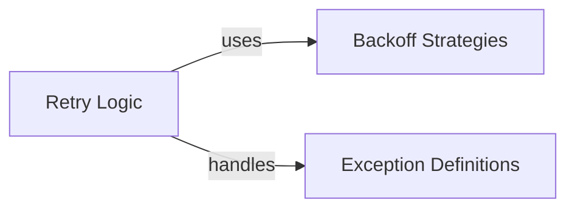

## Component Details

The Resilience & Error Handling subsystem provides robust mechanisms for managing operational failures within the Valkey client. It encompasses retry strategies with configurable backoff policies to re-attempt failed operations, and a comprehensive set of custom exception classes that offer detailed context for various error conditions, ensuring structured and effective error management throughout the library.

### Retry Logic
This component encapsulates the retry mechanism, allowing operations to be re-attempted a specified number of times with configurable delays. It integrates with backoff strategies to manage retry intervals effectively.

**Related Classes/Methods**:

- <a href="https://github.com/valkey-io/valkey-py/blob/master/valkey/retry.py#L13-L70" target="_blank" rel="noopener noreferrer">`valkey.retry.Retry` (13:70)</a>
- <a href="https://github.com/valkey-io/valkey-py/blob/master/valkey/retry.py#L47-L70" target="_blank" rel="noopener noreferrer">`valkey.retry.Retry.call_with_retry` (47:70)</a>
- <a href="https://github.com/valkey-io/valkey-py/blob/master/valkey/retry.py#L37-L45" target="_blank" rel="noopener noreferrer">`valkey.retry.Retry.update_supported_errors` (37:45)</a>

### Backoff Strategies
This component provides various strategies for implementing exponential backoff and jitter, which are crucial for robust retry mechanisms in network operations. It includes classes like `NoBackoff`, `ConstantBackoff`, `EqualJitterBackoff`, `ExponentialBackoff`, `FullJitterBackoff`, and `DecorrelatedJitterBackoff` to control the delay between retries.

**Related Classes/Methods**:

- <a href="https://github.com/valkey-io/valkey-py/blob/master/valkey/backoff.py#L38-L42" target="_blank" rel="noopener noreferrer">`valkey.backoff.NoBackoff` (38:42)</a>
- <a href="https://github.com/valkey-io/valkey-py/blob/master/valkey/backoff.py#L27-L35" target="_blank" rel="noopener noreferrer">`valkey.backoff.ConstantBackoff` (27:35)</a>
- <a href="https://github.com/valkey-io/valkey-py/blob/master/valkey/backoff.py#L75-L88" target="_blank" rel="noopener noreferrer">`valkey.backoff.EqualJitterBackoff` (75:88)</a>
- <a href="https://github.com/valkey-io/valkey-py/blob/master/valkey/backoff.py#L45-L57" target="_blank" rel="noopener noreferrer">`valkey.backoff.ExponentialBackoff` (45:57)</a>
- <a href="https://github.com/valkey-io/valkey-py/blob/master/valkey/backoff.py#L60-L72" target="_blank" rel="noopener noreferrer">`valkey.backoff.FullJitterBackoff` (60:72)</a>
- <a href="https://github.com/valkey-io/valkey-py/blob/master/valkey/backoff.py#L91-L110" target="_blank" rel="noopener noreferrer">`valkey.backoff.DecorrelatedJitterBackoff` (91:110)</a>
- <a href="https://github.com/valkey-io/valkey-py/blob/master/valkey/backoff.py#L10-L24" target="_blank" rel="noopener noreferrer">`valkey.backoff.AbstractBackoff` (10:24)</a>
- <a href="https://github.com/valkey-io/valkey-py/blob/master/valkey/backoff.py#L113-L114" target="_blank" rel="noopener noreferrer">`valkey.backoff:default_backoff` (113:114)</a>

### Exception Definitions
This component defines all custom exception classes used throughout the `valkey-py` library. These exceptions provide specific error contexts for various operational failures, such as connection issues, data errors, cluster errors, and lock-related problems.

**Related Classes/Methods**:

- <a href="https://github.com/valkey-io/valkey-py/blob/master/valkey/exceptions.py#L4-L5" target="_blank" rel="noopener noreferrer">`valkey.exceptions.ValkeyError` (4:5)</a>
- <a href="https://github.com/valkey-io/valkey-py/blob/master/valkey/exceptions.py#L8-L9" target="_blank" rel="noopener noreferrer">`valkey.exceptions.ConnectionError` (8:9)</a>
- <a href="https://github.com/valkey-io/valkey-py/blob/master/valkey/exceptions.py#L12-L13" target="_blank" rel="noopener noreferrer">`valkey.exceptions.TimeoutError` (12:13)</a>
- <a href="https://github.com/valkey-io/valkey-py/blob/master/valkey/exceptions.py#L16-L17" target="_blank" rel="noopener noreferrer">`valkey.exceptions.AuthenticationError` (16:17)</a>
- <a href="https://github.com/valkey-io/valkey-py/blob/master/valkey/exceptions.py#L20-L21" target="_blank" rel="noopener noreferrer">`valkey.exceptions.AuthorizationError` (20:21)</a>
- <a href="https://github.com/valkey-io/valkey-py/blob/master/valkey/exceptions.py#L24-L25" target="_blank" rel="noopener noreferrer">`valkey.exceptions.BusyLoadingError` (24:25)</a>
- <a href="https://github.com/valkey-io/valkey-py/blob/master/valkey/exceptions.py#L28-L29" target="_blank" rel="noopener noreferrer">`valkey.exceptions.InvalidResponse` (28:29)</a>
- <a href="https://github.com/valkey-io/valkey-py/blob/master/valkey/exceptions.py#L32-L33" target="_blank" rel="noopener noreferrer">`valkey.exceptions.ResponseError` (32:33)</a>
- <a href="https://github.com/valkey-io/valkey-py/blob/master/valkey/exceptions.py#L36-L37" target="_blank" rel="noopener noreferrer">`valkey.exceptions.DataError` (36:37)</a>
- <a href="https://github.com/valkey-io/valkey-py/blob/master/valkey/exceptions.py#L40-L41" target="_blank" rel="noopener noreferrer">`valkey.exceptions.PubSubError` (40:41)</a>
- <a href="https://github.com/valkey-io/valkey-py/blob/master/valkey/exceptions.py#L44-L45" target="_blank" rel="noopener noreferrer">`valkey.exceptions.WatchError` (44:45)</a>
- <a href="https://github.com/valkey-io/valkey-py/blob/master/valkey/exceptions.py#L48-L49" target="_blank" rel="noopener noreferrer">`valkey.exceptions.NoScriptError` (48:49)</a>
- <a href="https://github.com/valkey-io/valkey-py/blob/master/valkey/exceptions.py#L52-L61" target="_blank" rel="noopener noreferrer">`valkey.exceptions.OutOfMemoryError` (52:61)</a>
- <a href="https://github.com/valkey-io/valkey-py/blob/master/valkey/exceptions.py#L64-L65" target="_blank" rel="noopener noreferrer">`valkey.exceptions.ExecAbortError` (64:65)</a>
- <a href="https://github.com/valkey-io/valkey-py/blob/master/valkey/exceptions.py#L68-L69" target="_blank" rel="noopener noreferrer">`valkey.exceptions.ReadOnlyError` (68:69)</a>
- <a href="https://github.com/valkey-io/valkey-py/blob/master/valkey/exceptions.py#L72-L73" target="_blank" rel="noopener noreferrer">`valkey.exceptions.NoPermissionError` (72:73)</a>
- <a href="https://github.com/valkey-io/valkey-py/blob/master/valkey/exceptions.py#L76-L77" target="_blank" rel="noopener noreferrer">`valkey.exceptions.ModuleError` (76:77)</a>
- <a href="https://github.com/valkey-io/valkey-py/blob/master/valkey/exceptions.py#L80-L88" target="_blank" rel="noopener noreferrer">`valkey.exceptions.LockError` (80:88)</a>
- <a href="https://github.com/valkey-io/valkey-py/blob/master/valkey/exceptions.py#L91-L94" target="_blank" rel="noopener noreferrer">`valkey.exceptions.LockNotOwnedError` (91:94)</a>
- <a href="https://github.com/valkey-io/valkey-py/blob/master/valkey/exceptions.py#L97-L100" target="_blank" rel="noopener noreferrer">`valkey.exceptions.ChildDeadlockedError` (97:100)</a>
- <a href="https://github.com/valkey-io/valkey-py/blob/master/valkey/exceptions.py#L103-L109" target="_blank" rel="noopener noreferrer">`valkey.exceptions.AuthenticationWrongNumberOfArgsError` (103:109)</a>
- <a href="https://github.com/valkey-io/valkey-py/blob/master/valkey/exceptions.py#L112-L117" target="_blank" rel="noopener noreferrer">`valkey.exceptions.ValkeyClusterException` (112:117)</a>
- <a href="https://github.com/valkey-io/valkey-py/blob/master/valkey/exceptions.py#L120-L126" target="_blank" rel="noopener noreferrer">`valkey.exceptions.ClusterError` (120:126)</a>
- <a href="https://github.com/valkey-io/valkey-py/blob/master/valkey/exceptions.py#L129-L142" target="_blank" rel="noopener noreferrer">`valkey.exceptions.ClusterDownError` (129:142)</a>
- <a href="https://github.com/valkey-io/valkey-py/blob/master/valkey/exceptions.py#L145-L168" target="_blank" rel="noopener noreferrer">`valkey.exceptions.AskError` (145:168)</a>
- <a href="https://github.com/valkey-io/valkey-py/blob/master/valkey/exceptions.py#L171-L179" target="_blank" rel="noopener noreferrer">`valkey.exceptions.TryAgainError` (171:179)</a>
- <a href="https://github.com/valkey-io/valkey-py/blob/master/valkey/exceptions.py#L182-L189" target="_blank" rel="noopener noreferrer">`valkey.exceptions.ClusterCrossSlotError` (182:189)</a>
- <a href="https://github.com/valkey-io/valkey-py/blob/master/valkey/exceptions.py#L192-L199" target="_blank" rel="noopener noreferrer">`valkey.exceptions.MovedError` (192:199)</a>
- <a href="https://github.com/valkey-io/valkey-py/blob/master/valkey/exceptions.py#L202-L208" target="_blank" rel="noopener noreferrer">`valkey.exceptions.MasterDownError` (202:208)</a>
- <a href="https://github.com/valkey-io/valkey-py/blob/master/valkey/exceptions.py#L211-L220" target="_blank" rel="noopener noreferrer">`valkey.exceptions.SlotNotCoveredError` (211:220)</a>
- <a href="https://github.com/valkey-io/valkey-py/blob/master/valkey/exceptions.py#L223-L223" target="_blank" rel="noopener noreferrer">`valkey.exceptions.MaxConnectionsError` (223:223)</a>

### [FAQ](https://github.com/CodeBoarding/GeneratedOnBoardings/tree/main?tab=readme-ov-file#faq)