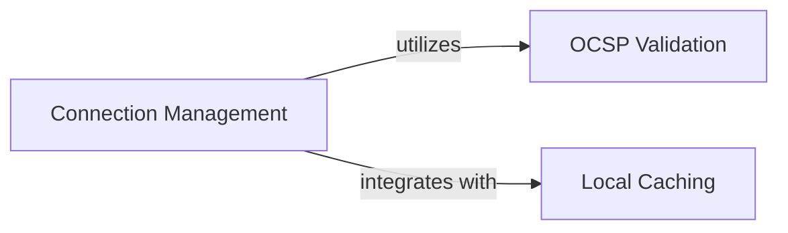

## Component Details

This graph illustrates the structure and interactions within the 'Security & Performance Enhancements' subsystem of the project. It focuses on three core components: 'OCSP Validation' for ensuring certificate validity, 'Local Caching' for optimizing data access, and 'Connection Management' which orchestrates the establishment and maintenance of connections while integrating both OCSP validation and local caching to enhance security and performance.

### OCSP Validation
This component is responsible for validating SSL/TLS certificates using the Online Certificate Status Protocol (OCSP). It includes functionalities for verifying OCSP responses, checking certificate validity, retrieving certificate components, and handling OCSP stapling. It interacts with external services to fetch certificate information and handles various connection and authorization errors related to OCSP validation.

**Related Classes/Methods**:

- <a href="https://github.com/valkey-io/valkey-py/blob/master/valkey/ocsp.py#L169-L307" target="_blank" rel="noopener noreferrer">`valkey.ocsp.OCSPVerifier` (169:307)</a>
- `valkey.ocsp` (full file reference)
- <a href="https://github.com/valkey-io/valkey-py/blob/master/valkey/ocsp.py#L21-L46" target="_blank" rel="noopener noreferrer">`valkey.ocsp:_verify_response` (21:46)</a>
- <a href="https://github.com/valkey-io/valkey-py/blob/master/valkey/ocsp.py#L49-L105" target="_blank" rel="noopener noreferrer">`valkey.ocsp:_check_certificate` (49:105)</a>
- <a href="https://github.com/valkey-io/valkey-py/blob/master/valkey/ocsp.py#L108-L122" target="_blank" rel="noopener noreferrer">`valkey.ocsp:_get_certificates` (108:122)</a>
- <a href="https://github.com/valkey-io/valkey-py/blob/master/valkey/ocsp.py#L125-L138" target="_blank" rel="noopener noreferrer">`valkey.ocsp:_get_pubkey_hash` (125:138)</a>
- <a href="https://github.com/valkey-io/valkey-py/blob/master/valkey/ocsp.py#L141-L166" target="_blank" rel="noopener noreferrer">`valkey.ocsp:ocsp_staple_verifier` (141:166)</a>
- <a href="https://github.com/valkey-io/valkey-py/blob/master/valkey/ocsp.py#L190-L200" target="_blank" rel="noopener noreferrer">`valkey.ocsp.OCSPVerifier:components_from_socket` (190:200)</a>
- <a href="https://github.com/valkey-io/valkey-py/blob/master/valkey/ocsp.py#L202-L240" target="_blank" rel="noopener noreferrer">`valkey.ocsp.OCSPVerifier:_certificate_components` (202:240)</a>
- <a href="https://github.com/valkey-io/valkey-py/blob/master/valkey/ocsp.py#L242-L250" target="_blank" rel="noopener noreferrer">`valkey.ocsp.OCSPVerifier:components_from_direct_connection` (242:250)</a>
- <a href="https://github.com/valkey-io/valkey-py/blob/master/valkey/ocsp.py#L268-L287" target="_blank" rel="noopener noreferrer">`valkey.ocsp.OCSPVerifier:check_certificate` (268:287)</a>
- <a href="https://github.com/valkey-io/valkey-py/blob/master/valkey/ocsp.py#L289-L307" target="_blank" rel="noopener noreferrer">`valkey.ocsp.OCSPVerifier:is_valid` (289:307)</a>
- <a href="https://github.com/valkey-io/valkey-py/blob/master/valkey/ocsp.py#L252-L266" target="_blank" rel="noopener noreferrer">`valkey.ocsp.OCSPVerifier.build_certificate_url` (252:266)</a>
- <a href="https://github.com/valkey-io/valkey-py/blob/master/valkey/ocsp.py#L183-L188" target="_blank" rel="noopener noreferrer">`valkey.ocsp.OCSPVerifier._bin2ascii` (183:188)</a>

### Local Caching
This component provides a client-side caching mechanism for Valkey commands and their responses. It supports different eviction policies (LRU, LFU, Random) and manages the storage, retrieval, and invalidation of cached data based on TTL and command/key associations.

**Related Classes/Methods**:

- <a href="https://github.com/valkey-io/valkey-py/blob/master/valkey/_cache.py#L199-L385" target="_blank" rel="noopener noreferrer">`valkey._cache._LocalCache` (199:385)</a>
- <a href="https://github.com/valkey-io/valkey-py/blob/master/valkey/_cache.py#L230-L253" target="_blank" rel="noopener noreferrer">`valkey._cache._LocalCache:set` (230:253)</a>
- <a href="https://github.com/valkey-io/valkey-py/blob/master/valkey/_cache.py#L255-L270" target="_blank" rel="noopener noreferrer">`valkey._cache._LocalCache:get` (255:270)</a>
- <a href="https://github.com/valkey-io/valkey-py/blob/master/valkey/_cache.py#L272-L283" target="_blank" rel="noopener noreferrer">`valkey._cache._LocalCache:delete_command` (272:283)</a>
- <a href="https://github.com/valkey-io/valkey-py/blob/master/valkey/_cache.py#L285-L294" target="_blank" rel="noopener noreferrer">`valkey._cache._LocalCache:delete_commands` (285:294)</a>
- <a href="https://github.com/valkey-io/valkey-py/blob/master/valkey/_cache.py#L333-L346" target="_blank" rel="noopener noreferrer">`valkey._cache._LocalCache:_evict` (333:346)</a>
- <a href="https://github.com/valkey-io/valkey-py/blob/master/valkey/_cache.py#L374-L385" target="_blank" rel="noopener noreferrer">`valkey._cache._LocalCache:invalidate_key` (374:385)</a>
- <a href="https://github.com/valkey-io/valkey-py/blob/master/valkey/_cache.py#L302-L314" target="_blank" rel="noopener noreferrer">`valkey._cache._LocalCache:_is_expired` (302:314)</a>
- <a href="https://github.com/valkey-io/valkey-py/blob/master/valkey/_cache.py#L316-L331" target="_blank" rel="noopener noreferrer">`valkey._cache._LocalCache:_update_access` (316:331)</a>
- <a href="https://github.com/valkey-io/valkey-py/blob/master/valkey/_cache.py#L348-L359" target="_blank" rel="noopener noreferrer">`valkey._cache._LocalCache:_update_key_commands_map` (348:359)</a>
- <a href="https://github.com/valkey-io/valkey-py/blob/master/valkey/_cache.py#L361-L372" target="_blank" rel="noopener noreferrer">`valkey._cache._LocalCache:_del_key_commands_map` (361:372)</a>

### Connection Management
This component is responsible for establishing, maintaining, and managing connections to the Valkey server. It handles various connection types (TCP, SSL, Unix Domain Socket), authentication, database selection, client naming, and health checks. It also integrates with the local caching mechanism for client-side caching and manages connection pooling.

**Related Classes/Methods**:

- <a href="https://github.com/valkey-io/valkey-py/blob/master/valkey/connection.py#L147-L676" target="_blank" rel="noopener noreferrer">`valkey.connection.AbstractConnection` (147:676)</a>
- <a href="https://github.com/valkey-io/valkey-py/blob/master/valkey/connection.py#L150-L256" target="_blank" rel="noopener noreferrer">`valkey.connection.AbstractConnection:__init__` (150:256)</a>
- <a href="https://github.com/valkey-io/valkey-py/blob/master/valkey/connection.py#L272-L278" target="_blank" rel="noopener noreferrer">`valkey.connection.AbstractConnection._construct_command_packer` (272:278)</a>
- <a href="https://github.com/valkey-io/valkey-py/blob/master/valkey/connection.py#L303-L309" target="_blank" rel="noopener noreferrer">`valkey.connection.AbstractConnection.set_parser` (303:309)</a>
- <a href="https://github.com/valkey-io/valkey-py/blob/master/valkey/connection.py#L749-L915" target="_blank" rel="noopener noreferrer">`valkey.connection.SSLConnection` (749:915)</a>
- <a href="https://github.com/valkey-io/valkey-py/blob/master/valkey/connection.py#L755-L825" target="_blank" rel="noopener noreferrer">`valkey.connection.SSLConnection:__init__` (755:825)</a>
- <a href="https://github.com/valkey-io/valkey-py/blob/master/valkey/connection.py#L827-L834" target="_blank" rel="noopener noreferrer">`valkey.connection.SSLConnection:_connect` (827:834)</a>
- <a href="https://github.com/valkey-io/valkey-py/blob/master/valkey/connection.py#L836-L915" target="_blank" rel="noopener noreferrer">`valkey.connection.SSLConnection:_wrap_socket_with_ssl` (836:915)</a>
- <a href="https://github.com/valkey-io/valkey-py/blob/master/valkey/asyncio/connection.py#L134-L233" target="_blank" rel="noopener noreferrer">`valkey.asyncio.connection.AbstractConnection:__init__` (134:233)</a>
- <a href="https://github.com/valkey-io/valkey-py/blob/master/valkey/asyncio/connection.py#L811-L833" target="_blank" rel="noopener noreferrer">`valkey.asyncio.connection.SSLConnection:__init__` (811:833)</a>
- <a href="https://github.com/valkey-io/valkey-py/blob/master/valkey/asyncio/connection.py#L835-L838" target="_blank" rel="noopener noreferrer">`valkey.asyncio.connection.SSLConnection:_connection_arguments` (835:838)</a>
- <a href="https://github.com/valkey-io/valkey-py/blob/master/valkey/connection.py#L682-L696" target="_blank" rel="noopener noreferrer">`valkey.connection.Connection.__init__` (682:696)</a>
- <a href="https://github.com/valkey-io/valkey-py/blob/master/valkey/connection.py#L704-L743" target="_blank" rel="noopener noreferrer">`valkey.connection.Connection._connect` (704:743)</a>

### [FAQ](https://github.com/CodeBoarding/GeneratedOnBoardings/tree/main?tab=readme-ov-file#faq)