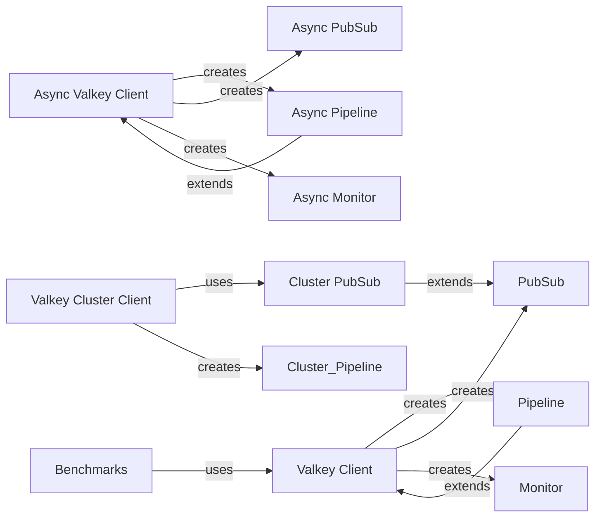

## Component Details

This overview details the core components of the Valkey client library, encompassing both synchronous and asynchronous interfaces for interacting with a Valkey server. It covers fundamental client operations, specialized functionalities like pipelining, publish/subscribe, and monitoring, as well as extensions for Valkey Cluster environments. The primary flow involves clients establishing connections, executing commands, and managing responses, with specialized components handling batch operations, real-time message streams, and cluster-specific routing.

### Valkey Client
The Valkey Client is the primary interface for synchronous interactions with a Valkey server. It manages connections through a connection pool, handles command execution, and parses responses. It also serves as a factory for creating specialized client objects like Pipelines, PubSub, and Monitor instances, enabling various interaction patterns with Valkey.

**Related Classes/Methods**:

- <a href="https://github.com/valkey-io/valkey-py/blob/master/valkey/client.py#L92-L619" target="_blank" rel="noopener noreferrer">`valkey.client.Valkey` (92:619)</a>
- <a href="https://github.com/valkey-io/valkey-py/blob/master/valkey/client.py#L108-L154" target="_blank" rel="noopener noreferrer">`valkey.client.Valkey.from_url` (108:154)</a>
- <a href="https://github.com/valkey-io/valkey-py/blob/master/valkey/client.py#L157-L170" target="_blank" rel="noopener noreferrer">`valkey.client.Valkey.from_pool` (157:170)</a>
- <a href="https://github.com/valkey-io/valkey-py/blob/master/valkey/client.py#L172-L338" target="_blank" rel="noopener noreferrer">`valkey.client.Valkey.__init__` (172:338)</a>
- <a href="https://github.com/valkey-io/valkey-py/blob/master/valkey/client.py#L388-L398" target="_blank" rel="noopener noreferrer">`valkey.client.Valkey.pipeline` (388:398)</a>
- <a href="https://github.com/valkey-io/valkey-py/blob/master/valkey/client.py#L400-L422" target="_blank" rel="noopener noreferrer">`valkey.client.Valkey.transaction` (400:422)</a>
- <a href="https://github.com/valkey-io/valkey-py/blob/master/valkey/client.py#L498-L504" target="_blank" rel="noopener noreferrer">`valkey.client.Valkey.pubsub` (498:504)</a>
- <a href="https://github.com/valkey-io/valkey-py/blob/master/valkey/client.py#L506-L507" target="_blank" rel="noopener noreferrer">`valkey.client.Valkey.monitor` (506:507)</a>
- <a href="https://github.com/valkey-io/valkey-py/blob/master/valkey/client.py#L509-L512" target="_blank" rel="noopener noreferrer">`valkey.client.Valkey.client` (509:512)</a>
- <a href="https://github.com/valkey-io/valkey-py/blob/master/valkey/client.py#L517-L518" target="_blank" rel="noopener noreferrer">`valkey.client.Valkey.__exit__` (517:518)</a>
- <a href="https://github.com/valkey-io/valkey-py/blob/master/valkey/client.py#L520-L521" target="_blank" rel="noopener noreferrer">`valkey.client.Valkey.__del__` (520:521)</a>
- <a href="https://github.com/valkey-io/valkey-py/blob/master/valkey/client.py#L538-L543" target="_blank" rel="noopener noreferrer">`valkey.client.Valkey._send_command_parse_response` (538:543)</a>
- <a href="https://github.com/valkey-io/valkey-py/blob/master/valkey/client.py#L559-L581" target="_blank" rel="noopener noreferrer">`valkey.client.Valkey.execute_command` (559:581)</a>
- <a href="https://github.com/valkey-io/valkey-py/blob/master/valkey/client.py#L583-L601" target="_blank" rel="noopener noreferrer">`valkey.client.Valkey.parse_response` (583:601)</a>
- <a href="https://github.com/valkey-io/valkey-py/blob/master/valkey/client.py#L61-L85" target="_blank" rel="noopener noreferrer">`valkey.client.CaseInsensitiveDict` (61:85)</a>
- <a href="https://github.com/valkey-io/valkey-py/blob/master/valkey/connection.py#L952-L1235" target="_blank" rel="noopener noreferrer">`valkey.connection.ConnectionPool` (952:1235)</a>

### Pipeline
The Pipeline component enables batch processing of multiple Valkey commands, sending them to the server in a single network round trip to improve efficiency. It supports atomic execution of commands within a transaction (MULTI/EXEC) and collects responses, allowing for individual command error handling without halting the entire sequence.

**Related Classes/Methods**:

- <a href="https://github.com/valkey-io/valkey-py/blob/master/valkey/client.py#L1224-L1569" target="_blank" rel="noopener noreferrer">`valkey.client.Pipeline` (1224:1569)</a>
- <a href="https://github.com/valkey-io/valkey-py/blob/master/valkey/client.py#L1245-L1253" target="_blank" rel="noopener noreferrer">`valkey.client.Pipeline.__init__` (1245:1253)</a>
- <a href="https://github.com/valkey-io/valkey-py/blob/master/valkey/client.py#L1258-L1259" target="_blank" rel="noopener noreferrer">`valkey.client.Pipeline.__exit__` (1258:1259)</a>
- <a href="https://github.com/valkey-io/valkey-py/blob/master/valkey/client.py#L1261-L1265" target="_blank" rel="noopener noreferrer">`valkey.client.Pipeline.__del__` (1261:1265)</a>
- <a href="https://github.com/valkey-io/valkey-py/blob/master/valkey/client.py#L1297-L1299" target="_blank" rel="noopener noreferrer">`valkey.client.Pipeline.close` (1297:1299)</a>
- <a href="https://github.com/valkey-io/valkey-py/blob/master/valkey/client.py#L1301-L1312" target="_blank" rel="noopener noreferrer">`valkey.client.Pipeline.multi` (1301:1312)</a>
- <a href="https://github.com/valkey-io/valkey-py/blob/master/valkey/client.py#L1314-L1318" target="_blank" rel="noopener noreferrer">`valkey.client.Pipeline.execute_command` (1314:1318)</a>
- <a href="https://github.com/valkey-io/valkey-py/blob/master/valkey/client.py#L1320-L1343" target="_blank" rel="noopener noreferrer">`valkey.client.Pipeline._disconnect_reset_raise` (1320:1343)</a>
- <a href="https://github.com/valkey-io/valkey-py/blob/master/valkey/client.py#L1345-L1364" target="_blank" rel="noopener noreferrer">`valkey.client.Pipeline.immediate_execute_command` (1345:1364)</a>
- <a href="https://github.com/valkey-io/valkey-py/blob/master/valkey/client.py#L1381-L1446" target="_blank" rel="noopener noreferrer">`valkey.client.Pipeline._execute_transaction` (1381:1446)</a>
- <a href="https://github.com/valkey-io/valkey-py/blob/master/valkey/client.py#L1448-L1462" target="_blank" rel="noopener noreferrer">`valkey.client.Pipeline._execute_pipeline` (1448:1462)</a>
- <a href="https://github.com/valkey-io/valkey-py/blob/master/valkey/client.py#L1464-L1468" target="_blank" rel="noopener noreferrer">`valkey.client.Pipeline.raise_first_error` (1464:1468)</a>
- <a href="https://github.com/valkey-io/valkey-py/blob/master/valkey/client.py#L1478-L1484" target="_blank" rel="noopener noreferrer">`valkey.client.Pipeline.parse_response` (1478:1484)</a>
- <a href="https://github.com/valkey-io/valkey-py/blob/master/valkey/client.py#L1486-L1497" target="_blank" rel="noopener noreferrer">`valkey.client.Pipeline.load_scripts` (1486:1497)</a>
- <a href="https://github.com/valkey-io/valkey-py/blob/master/valkey/client.py#L1499-L1525" target="_blank" rel="noopener noreferrer">`valkey.client.Pipeline._disconnect_raise_reset` (1499:1525)</a>
- <a href="https://github.com/valkey-io/valkey-py/blob/master/valkey/client.py#L1527-L1552" target="_blank" rel="noopener noreferrer">`valkey.client.Pipeline.execute` (1527:1552)</a>
- <a href="https://github.com/valkey-io/valkey-py/blob/master/valkey/client.py#L1554-L1559" target="_blank" rel="noopener noreferrer">`valkey.client.Pipeline.discard` (1554:1559)</a>
- <a href="https://github.com/valkey-io/valkey-py/blob/master/valkey/client.py#L1561-L1565" target="_blank" rel="noopener noreferrer">`valkey.client.Pipeline.watch` (1561:1565)</a>
- <a href="https://github.com/valkey-io/valkey-py/blob/master/valkey/client.py#L1567-L1569" target="_blank" rel="noopener noreferrer">`valkey.client.Pipeline.unwatch` (1567:1569)</a>

### PubSub
The PubSub component provides synchronous publish/subscribe capabilities, allowing clients to subscribe to channels and patterns and receive messages. It manages the lifecycle of pub/sub connections, handles message parsing, and supports message handlers for automated processing of incoming messages.

**Related Classes/Methods**:

- <a href="https://github.com/valkey-io/valkey-py/blob/master/valkey/client.py#L692-L1182" target="_blank" rel="noopener noreferrer">`valkey.client.PubSub` (692:1182)</a>
- <a href="https://github.com/valkey-io/valkey-py/blob/master/valkey/client.py#L705-L731" target="_blank" rel="noopener noreferrer">`valkey.client.PubSub.__init__` (705:731)</a>
- <a href="https://github.com/valkey-io/valkey-py/blob/master/valkey/client.py#L736-L737" target="_blank" rel="noopener noreferrer">`valkey.client.PubSub.__exit__` (736:737)</a>
- <a href="https://github.com/valkey-io/valkey-py/blob/master/valkey/client.py#L739-L746" target="_blank" rel="noopener noreferrer">`valkey.client.PubSub.__del__` (739:746)</a>
- <a href="https://github.com/valkey-io/valkey-py/blob/master/valkey/client.py#L763-L764" target="_blank" rel="noopener noreferrer">`valkey.client.PubSub.close` (763:764)</a>
- <a href="https://github.com/valkey-io/valkey-py/blob/master/valkey/client.py#L766-L789" target="_blank" rel="noopener noreferrer">`valkey.client.PubSub.on_connect` (766:789)</a>
- <a href="https://github.com/valkey-io/valkey-py/blob/master/valkey/client.py#L796-L816" target="_blank" rel="noopener noreferrer">`valkey.client.PubSub.execute_command` (796:816)</a>
- <a href="https://github.com/valkey-io/valkey-py/blob/master/valkey/client.py#L818-L834" target="_blank" rel="noopener noreferrer">`valkey.client.PubSub.clean_health_check_responses` (818:834)</a>
- <a href="https://github.com/valkey-io/valkey-py/blob/master/valkey/client.py#L851-L862" target="_blank" rel="noopener noreferrer">`valkey.client.PubSub._execute` (851:862)</a>
- <a href="https://github.com/valkey-io/valkey-py/blob/master/valkey/client.py#L864-L889" target="_blank" rel="noopener noreferrer">`valkey.client.PubSub.parse_response` (864:889)</a>
- <a href="https://github.com/valkey-io/valkey-py/blob/master/valkey/client.py#L924-L948" target="_blank" rel="noopener noreferrer">`valkey.client.PubSub.psubscribe` (924:948)</a>
- <a href="https://github.com/valkey-io/valkey-py/blob/master/valkey/client.py#L950-L961" target="_blank" rel="noopener noreferrer">`valkey.client.PubSub.punsubscribe` (950:961)</a>
- <a href="https://github.com/valkey-io/valkey-py/blob/master/valkey/client.py#L963-L987" target="_blank" rel="noopener noreferrer">`valkey.client.PubSub.subscribe` (963:987)</a>
- <a href="https://github.com/valkey-io/valkey-py/blob/master/valkey/client.py#L989-L1000" target="_blank" rel="noopener noreferrer">`valkey.client.PubSub.unsubscribe` (989:1000)</a>
- <a href="https://github.com/valkey-io/valkey-py/blob/master/valkey/client.py#L1002-L1026" target="_blank" rel="noopener noreferrer">`valkey.client.PubSub.ssubscribe` (1002:1026)</a>
- <a href="https://github.com/valkey-io/valkey-py/blob/master/valkey/client.py#L1028-L1039" target="_blank" rel="noopener noreferrer">`valkey.client.PubSub.sunsubscribe` (1028:1039)</a>
- <a href="https://github.com/valkey-io/valkey-py/blob/master/valkey/client.py#L1041-L1046" target="_blank" rel="noopener noreferrer">`valkey.client.PubSub.listen` (1041:1046)</a>
- <a href="https://github.com/valkey-io/valkey-py/blob/master/valkey/client.py#L1048-L1075" target="_blank" rel="noopener noreferrer">`valkey.client.PubSub.get_message` (1048:1075)</a>
- <a href="https://github.com/valkey-io/valkey-py/blob/master/valkey/client.py#L1079-L1084" target="_blank" rel="noopener noreferrer">`valkey.client.PubSub.ping` (1079:1084)</a>
- <a href="https://github.com/valkey-io/valkey-py/blob/master/valkey/client.py#L1086-L1158" target="_blank" rel="noopener noreferrer">`valkey.client.PubSub.handle_message` (1086:1158)</a>
- <a href="https://github.com/valkey-io/valkey-py/blob/master/valkey/client.py#L1160-L1182" target="_blank" rel="noopener noreferrer">`valkey.client.PubSub.run_in_thread` (1160:1182)</a>
- <a href="https://github.com/valkey-io/valkey-py/blob/master/valkey/client.py#L1185-L1221" target="_blank" rel="noopener noreferrer">`valkey.client.PubSubWorkerThread` (1185:1221)</a>

### Monitor
The Monitor component provides a synchronous interface to the Valkey MONITOR command, allowing clients to observe all commands processed by the Valkey server in real-time. It parses the raw monitor output into structured command information.

**Related Classes/Methods**:

- <a href="https://github.com/valkey-io/valkey-py/blob/master/valkey/client.py#L625-L689" target="_blank" rel="noopener noreferrer">`valkey.client.Monitor` (625:689)</a>
- <a href="https://github.com/valkey-io/valkey-py/blob/master/valkey/client.py#L639-L645" target="_blank" rel="noopener noreferrer">`valkey.client.Monitor.__enter__` (639:645)</a>
- <a href="https://github.com/valkey-io/valkey-py/blob/master/valkey/client.py#L686-L689" target="_blank" rel="noopener noreferrer">`valkey.client.Monitor.listen` (686:689)</a>
- <a href="https://github.com/valkey-io/valkey-py/blob/master/valkey/client.py#L651-L684" target="_blank" rel="noopener noreferrer">`valkey.client.Monitor.next_command` (651:684)</a>

### Async Valkey Client
The Async Valkey Client is the asynchronous counterpart to the synchronous Valkey Client, designed for non-blocking interactions with a Valkey server using asyncio. It provides similar functionalities for command execution and response parsing in an asynchronous environment, and acts as a factory for asynchronous Pipeline, PubSub, and Monitor objects.

**Related Classes/Methods**:

- <a href="https://github.com/valkey-io/valkey-py/blob/master/valkey/asyncio/client.py#L101-L694" target="_blank" rel="noopener noreferrer">`valkey.asyncio.client.Valkey` (101:694)</a>
- <a href="https://github.com/valkey-io/valkey-py/blob/master/valkey/asyncio/client.py#L119-L183" target="_blank" rel="noopener noreferrer">`valkey.asyncio.client.Valkey.from_url` (119:183)</a>
- <a href="https://github.com/valkey-io/valkey-py/blob/master/valkey/asyncio/client.py#L186-L199" target="_blank" rel="noopener noreferrer">`valkey.asyncio.client.Valkey.from_pool` (186:199)</a>
- <a href="https://github.com/valkey-io/valkey-py/blob/master/valkey/asyncio/client.py#L201-L359" target="_blank" rel="noopener noreferrer">`valkey.asyncio.client.Valkey.__init__` (201:359)</a>
- <a href="https://github.com/valkey-io/valkey-py/blob/master/valkey/asyncio/client.py#L419-L431" target="_blank" rel="noopener noreferrer">`valkey.asyncio.client.Valkey.pipeline` (419:431)</a>
- <a href="https://github.com/valkey-io/valkey-py/blob/master/valkey/asyncio/client.py#L536-L542" target="_blank" rel="noopener noreferrer">`valkey.asyncio.client.Valkey.pubsub` (536:542)</a>
- <a href="https://github.com/valkey-io/valkey-py/blob/master/valkey/asyncio/client.py#L544-L545" target="_blank" rel="noopener noreferrer">`valkey.asyncio.client.Valkey.monitor` (544:545)</a>
- <a href="https://github.com/valkey-io/valkey-py/blob/master/valkey/asyncio/client.py#L595-L599" target="_blank" rel="noopener noreferrer">`valkey.asyncio.client.Valkey.close` (595:599)</a>
- <a href="https://github.com/valkey-io/valkey-py/blob/master/valkey/asyncio/connection.py#L969-L1174" target="_blank" rel="noopener noreferrer">`valkey.asyncio.connection.ConnectionPool` (969:1174)</a>

### Async Pipeline
The Async Pipeline component provides asynchronous batch command execution for Valkey, allowing multiple commands to be queued and sent in a single non-blocking operation. It supports transactional behavior and handles responses asynchronously, integrating with the asyncio event loop.

**Related Classes/Methods**:

- <a href="https://github.com/valkey-io/valkey-py/blob/master/valkey/asyncio/client.py#L1229-L1595" target="_blank" rel="noopener noreferrer">`valkey.asyncio.client.Pipeline` (1229:1595)</a>
- <a href="https://github.com/valkey-io/valkey-py/blob/master/valkey/asyncio/client.py#L1316-L1327" target="_blank" rel="noopener noreferrer">`valkey.asyncio.client.Pipeline.multi` (1316:1327)</a>
- <a href="https://github.com/valkey-io/valkey-py/blob/master/valkey/asyncio/client.py#L1337-L1360" target="_blank" rel="noopener noreferrer">`valkey.asyncio.client.Pipeline._disconnect_reset_raise` (1337:1360)</a>
- <a href="https://github.com/valkey-io/valkey-py/blob/master/valkey/asyncio/client.py#L1400-L1472" target="_blank" rel="noopener noreferrer">`valkey.asyncio.client.Pipeline._execute_transaction` (1400:1472)</a>
- <a href="https://github.com/valkey-io/valkey-py/blob/master/valkey/asyncio/client.py#L1507-L1515" target="_blank" rel="noopener noreferrer">`valkey.asyncio.client.Pipeline.parse_response` (1507:1515)</a>
- <a href="https://github.com/valkey-io/valkey-py/blob/master/valkey/asyncio/client.py#L1530-L1551" target="_blank" rel="noopener noreferrer">`valkey.asyncio.client.Pipeline._disconnect_raise_reset` (1530:1551)</a>
- <a href="https://github.com/valkey-io/valkey-py/blob/master/valkey/asyncio/client.py#L1587-L1591" target="_blank" rel="noopener noreferrer">`valkey.asyncio.client.Pipeline.watch` (1587:1591)</a>

### Async PubSub
The Async PubSub component offers asynchronous publish/subscribe functionality, enabling clients to subscribe to channels and patterns and listen for messages in a non-blocking manner. It manages asynchronous connections and message handling, suitable for event-driven applications.

**Related Classes/Methods**:

- <a href="https://github.com/valkey-io/valkey-py/blob/master/valkey/asyncio/client.py#L782-L1209" target="_blank" rel="noopener noreferrer">`valkey.asyncio.client.PubSub` (782:1209)</a>
- <a href="https://github.com/valkey-io/valkey-py/blob/master/valkey/asyncio/client.py#L795-L829" target="_blank" rel="noopener noreferrer">`valkey.asyncio.client.PubSub.__init__` (795:829)</a>
- <a href="https://github.com/valkey-io/valkey-py/blob/master/valkey/asyncio/client.py#L834-L835" target="_blank" rel="noopener noreferrer">`valkey.asyncio.client.PubSub.__aexit__` (834:835)</a>
- <a href="https://github.com/valkey-io/valkey-py/blob/master/valkey/asyncio/client.py#L859-L861" target="_blank" rel="noopener noreferrer">`valkey.asyncio.client.PubSub.close` (859:861)</a>
- <a href="https://github.com/valkey-io/valkey-py/blob/master/valkey/asyncio/client.py#L864-L866" target="_blank" rel="noopener noreferrer">`valkey.asyncio.client.PubSub.reset` (864:866)</a>
- <a href="https://github.com/valkey-io/valkey-py/blob/master/valkey/asyncio/client.py#L868-L884" target="_blank" rel="noopener noreferrer">`valkey.asyncio.client.PubSub.on_connect` (868:884)</a>
- <a href="https://github.com/valkey-io/valkey-py/blob/master/valkey/asyncio/client.py#L891-L901" target="_blank" rel="noopener noreferrer">`valkey.asyncio.client.PubSub.execute_command` (891:901)</a>
- <a href="https://github.com/valkey-io/valkey-py/blob/master/valkey/asyncio/client.py#L934-L945" target="_blank" rel="noopener noreferrer">`valkey.asyncio.client.PubSub._execute` (934:945)</a>
- <a href="https://github.com/valkey-io/valkey-py/blob/master/valkey/asyncio/client.py#L947-L973" target="_blank" rel="noopener noreferrer">`valkey.asyncio.client.PubSub.parse_response` (947:973)</a>
- <a href="https://github.com/valkey-io/valkey-py/blob/master/valkey/asyncio/client.py#L1001-L1020" target="_blank" rel="noopener noreferrer">`valkey.asyncio.client.PubSub.psubscribe` (1001:1020)</a>
- <a href="https://github.com/valkey-io/valkey-py/blob/master/valkey/asyncio/client.py#L1022-L1035" target="_blank" rel="noopener noreferrer">`valkey.asyncio.client.PubSub.punsubscribe` (1022:1035)</a>
- <a href="https://github.com/valkey-io/valkey-py/blob/master/valkey/asyncio/client.py#L1037-L1056" target="_blank" rel="noopener noreferrer">`valkey.asyncio.client.PubSub.subscribe` (1037:1056)</a>
- <a href="https://github.com/valkey-io/valkey-py/blob/master/valkey/asyncio/client.py#L1058-L1070" target="_blank" rel="noopener noreferrer">`valkey.asyncio.client.PubSub.unsubscribe` (1058:1070)</a>
- <a href="https://github.com/valkey-io/valkey-py/blob/master/valkey/asyncio/client.py#L1072-L1077" target="_blank" rel="noopener noreferrer">`valkey.asyncio.client.PubSub.listen` (1072:1077)</a>
- <a href="https://github.com/valkey-io/valkey-py/blob/master/valkey/asyncio/client.py#L1079-L1092" target="_blank" rel="noopener noreferrer">`valkey.asyncio.client.PubSub.get_message` (1079:1092)</a>
- <a href="https://github.com/valkey-io/valkey-py/blob/master/valkey/asyncio/client.py#L1094-L1099" target="_blank" rel="noopener noreferrer">`valkey.asyncio.client.PubSub.ping` (1094:1099)</a>
- <a href="https://github.com/valkey-io/valkey-py/blob/master/valkey/asyncio/client.py#L1101-L1165" target="_blank" rel="noopener noreferrer">`valkey.asyncio.client.PubSub.handle_message` (1101:1165)</a>
- <a href="https://github.com/valkey-io/valkey-py/blob/master/valkey/asyncio/client.py#L1167-L1209" target="_blank" rel="noopener noreferrer">`valkey.asyncio.client.PubSub.run` (1167:1209)</a>

### Async Monitor
The Async Monitor component provides an asynchronous interface to the Valkey MONITOR command, allowing non-blocking observation of all commands processed by the Valkey server. It integrates with asyncio for efficient real-time monitoring.

**Related Classes/Methods**:

- <a href="https://github.com/valkey-io/valkey-py/blob/master/valkey/asyncio/client.py#L709-L779" target="_blank" rel="noopener noreferrer">`valkey.asyncio.client.Monitor` (709:779)</a>
- <a href="https://github.com/valkey-io/valkey-py/blob/master/valkey/asyncio/client.py#L727-L734" target="_blank" rel="noopener noreferrer">`valkey.asyncio.client.Monitor.__aenter__` (727:734)</a>
- <a href="https://github.com/valkey-io/valkey-py/blob/master/valkey/asyncio/client.py#L740-L774" target="_blank" rel="noopener noreferrer">`valkey.asyncio.client.Monitor.next_command` (740:774)</a>
- <a href="https://github.com/valkey-io/valkey-py/blob/master/valkey/asyncio/client.py#L776-L779" target="_blank" rel="noopener noreferrer">`valkey.asyncio.client.Monitor.listen` (776:779)</a>

### Valkey Cluster Client
The Valkey Cluster Client provides an interface for interacting with a Valkey Cluster. It handles the complexities of a clustered environment, including node discovery, command routing to the correct cluster slot, and managing connections across multiple nodes, abstracting the cluster topology from the user.

**Related Classes/Methods**:

- <a href="https://github.com/valkey-io/valkey-py/blob/master/valkey/cluster.py#L452-L1276" target="_blank" rel="noopener noreferrer">`valkey.cluster.ValkeyCluster` (452:1276)</a>
- <a href="https://github.com/valkey-io/valkey-py/blob/master/valkey/cluster.py#L495-L650" target="_blank" rel="noopener noreferrer">`valkey.cluster.ValkeyCluster.__init__` (495:650)</a>
- <a href="https://github.com/valkey-io/valkey-py/blob/master/valkey/cluster.py#L1279-L1316" target="_blank" rel="noopener noreferrer">`valkey.cluster.ClusterNode` (1279:1316)</a>
- <a href="https://github.com/valkey-io/valkey-py/blob/master/valkey/cluster.py#L1338-L1694" target="_blank" rel="noopener noreferrer">`valkey.cluster.NodesManager` (1338:1694)</a>
- <a href="https://github.com/valkey-io/valkey-py/blob/master/valkey/cluster.py#L181-L191" target="_blank" rel="noopener noreferrer">`valkey.cluster.cleanup_kwargs` (181:191)</a>
- <a href="https://github.com/valkey-io/valkey-py/blob/master/valkey/cluster.py#L1930-L2361" target="_blank" rel="noopener noreferrer">`valkey.cluster.ClusterPipeline` (1930:2361)</a>

### Cluster PubSub
The Cluster PubSub component is a specialized PubSub client designed for Valkey Cluster environments. It extends the standard PubSub functionality to manage subscriptions and message handling across the various nodes within a Valkey Cluster, ensuring messages are received regardless of their origin node.

**Related Classes/Methods**:

- <a href="https://github.com/valkey-io/valkey-py/blob/master/valkey/cluster.py#L1697-L1927" target="_blank" rel="noopener noreferrer">`valkey.cluster.ClusterPubSub` (1697:1927)</a>
- <a href="https://github.com/valkey-io/valkey-py/blob/master/valkey/cluster.py#L1706-L1743" target="_blank" rel="noopener noreferrer">`valkey.cluster.ClusterPubSub.__init__` (1706:1743)</a>
- <a href="https://github.com/valkey-io/valkey-py/blob/master/valkey/cluster.py#L1745-L1776" target="_blank" rel="noopener noreferrer">`valkey.cluster.ClusterPubSub.set_pubsub_node` (1745:1776)</a>
- <a href="https://github.com/valkey-io/valkey-py/blob/master/valkey/cluster.py#L1794-L1829" target="_blank" rel="noopener noreferrer">`valkey.cluster.ClusterPubSub.execute_command` (1794:1829)</a>
- <a href="https://github.com/valkey-io/valkey-py/blob/master/valkey/cluster.py#L1879-L1897" target="_blank" rel="noopener noreferrer">`valkey.cluster.ClusterPubSub.ssubscribe` (1879:1897)</a>

### Benchmarks
The Benchmarks module contains scripts and utilities for performance testing and benchmarking various basic operations of the valkey-py client library against a Valkey server. It helps in evaluating the efficiency and speed of different client interactions.

**Related Classes/Methods**:

- `valkey.benchmarks.basic_operations.run` (full file reference)
- `valkey.benchmarks.basic_operations.parse_args` (full file reference)
- `valkey.benchmarks.basic_operations.set_str` (full file reference)
- `valkey.benchmarks.basic_operations.set_int` (full file reference)
- `valkey.benchmarks.basic_operations.get_str` (full file reference)
- `valkey.benchmarks.basic_operations.get_int` (full file reference)
- `valkey.benchmarks.basic_operations.incr` (full file reference)
- `valkey.benchmarks.basic_operations.lpush` (full file reference)
- `valkey.benchmarks.basic_operations.lrange_300` (full file reference)
- `valkey.benchmarks.basic_operations.lpop` (full file reference)
- `valkey.benchmarks.basic_operations.hmset` (full file reference)
- `valkey.benchmarks.base.Benchmark.get_client` (full file reference)

### [FAQ](https://github.com/CodeBoarding/GeneratedOnBoardings/tree/main?tab=readme-ov-file#faq)