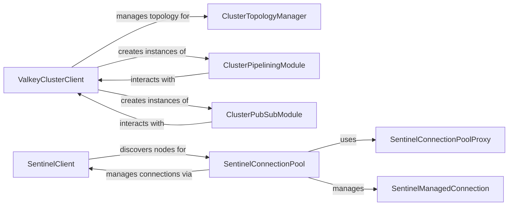

## Component Details

This subsystem manages connections and operations for both synchronous and asynchronous clients within Valkey Cluster and Sentinel environments. It handles crucial aspects like node discovery, slot mapping, failover mechanisms, and intelligent command routing to ensure high availability and efficient communication with Valkey instances. The core functionality revolves around maintaining an up-to-date view of the cluster topology, enabling batched command execution, and providing robust Pub/Sub capabilities, while also supporting dynamic master/replica discovery through Sentinel.

### ValkeyClusterClient
The core client for interacting with a Valkey cluster. It manages the overall cluster state, including node discovery, slot mapping, and command routing. It handles various cluster-specific errors like MOVED and ASK redirections, and provides mechanisms for retrying failed commands. This component serves as the entry entry point for most cluster operations.

**Related Classes/Methods**:

- <a href="https://github.com/valkey-io/valkey-py/blob/master/valkey/cluster.py#L452-L1276" target="_blank" rel="noopener noreferrer">`valkey.cluster.ValkeyCluster` (452:1276)</a>
- <a href="https://github.com/valkey-io/valkey-py/blob/master/valkey/asyncio/cluster.py#L99-L959" target="_blank" rel="noopener noreferrer">`valkey.asyncio.cluster.ValkeyCluster` (99:959)</a>
- <a href="https://github.com/valkey-io/valkey-py/blob/master/valkey/cluster.py#L208-L449" target="_blank" rel="noopener noreferrer">`valkey.cluster.AbstractValkeyCluster` (208:449)</a>
- <a href="https://github.com/valkey-io/valkey-py/blob/master/valkey/cluster.py#L1338-L1694" target="_blank" rel="noopener noreferrer">`valkey.cluster.NodesManager` (1338:1694)</a>
- <a href="https://github.com/valkey-io/valkey-py/blob/master/valkey/cluster.py#L1697-L1927" target="_blank" rel="noopener noreferrer">`valkey.cluster.ClusterPubSub` (1697:1927)</a>
- <a href="https://github.com/valkey-io/valkey-py/blob/master/valkey/cluster.py#L1930-L2361" target="_blank" rel="noopener noreferrer">`valkey.cluster.ClusterPipeline` (1930:2361)</a>
- <a href="https://github.com/valkey-io/valkey-py/blob/master/valkey/cluster.py#L1279-L1316" target="_blank" rel="noopener noreferrer">`valkey.cluster.ClusterNode` (1279:1316)</a>

### ClusterTopologyManager
Responsible for maintaining an up-to-date view of the Valkey cluster's topology, including the active nodes and their assigned hash slots. It discovers nodes, populates and updates node and slot caches, and provides methods to retrieve specific nodes based on various criteria (e.g., server type, slot ID). It also handles remapping of host/port addresses and manages individual node connections.

**Related Classes/Methods**:

- <a href="https://github.com/valkey-io/valkey-py/blob/master/valkey/cluster.py#L1338-L1694" target="_blank" rel="noopener noreferrer">`valkey.cluster.NodesManager` (1338:1694)</a>
- <a href="https://github.com/valkey-io/valkey-py/blob/master/valkey/asyncio/cluster.py#L1145-L1442" target="_blank" rel="noopener noreferrer">`valkey.asyncio.cluster.NodesManager` (1145:1442)</a>
- <a href="https://github.com/valkey-io/valkey-py/blob/master/valkey/cluster.py#L1279-L1316" target="_blank" rel="noopener noreferrer">`valkey.cluster.ClusterNode` (1279:1316)</a>
- <a href="https://github.com/valkey-io/valkey-py/blob/master/valkey/asyncio/cluster.py#L962-L1142" target="_blank" rel="noopener noreferrer">`valkey.asyncio.cluster.ClusterNode` (962:1142)</a>
- <a href="https://github.com/valkey-io/valkey-py/blob/master/valkey/cluster.py#L1319-L1335" target="_blank" rel="noopener noreferrer">`valkey.cluster.LoadBalancer` (1319:1335)</a>

### ClusterPipeliningModule
Enables the execution of multiple Valkey commands in a single batch (pipeline) within a cluster environment. It collects commands, groups them by target node, and sends them efficiently. This module also incorporates logic for handling errors and redirections that occur during pipelined execution, ensuring data consistency and retries.

**Related Classes/Methods**:

- <a href="https://github.com/valkey-io/valkey-py/blob/master/valkey/cluster.py#L1930-L2361" target="_blank" rel="noopener noreferrer">`valkey.cluster.ClusterPipeline` (1930:2361)</a>
- <a href="https://github.com/valkey-io/valkey-py/blob/master/valkey/asyncio/cluster.py#L1445-L1686" target="_blank" rel="noopener noreferrer">`valkey.asyncio.cluster.ClusterPipeline` (1445:1686)</a>
- <a href="https://github.com/valkey-io/valkey-py/blob/master/valkey/cluster.py#L2457-L2468" target="_blank" rel="noopener noreferrer">`valkey.cluster.PipelineCommand` (2457:2468)</a>
- <a href="https://github.com/valkey-io/valkey-py/blob/master/valkey/cluster.py#L2471-L2537" target="_blank" rel="noopener noreferrer">`valkey.cluster.NodeCommands` (2471:2537)</a>

### ClusterPubSubModule
Provides Publish/Subscribe functionality tailored for Valkey Cluster. It intelligently routes pub/sub commands to the correct cluster node based on the channel's keyslot, ensuring messages are published to and received from the appropriate shard.

**Related Classes/Methods**:

- <a href="https://github.com/valkey-io/valkey-py/blob/master/valkey/cluster.py#L1697-L1927" target="_blank" rel="noopener noreferrer">`valkey.cluster.ClusterPubSub` (1697:1927)</a>
- <a href="https://github.com/valkey-io/valkey-py/blob/master/valkey/asyncio/cluster.py#L1689-L1919" target="_blank" rel="noopener noreferrer">`valkey.asyncio.cluster.ClusterPubSub` (1689:1919)</a>

### SentinelClient
The client for interacting with Valkey Sentinel servers. Its primary role is to discover the current master and available replica nodes for a monitored Valkey service, enabling high availability and automatic failover capabilities.

**Related Classes/Methods**:

- <a href="https://github.com/valkey-io/valkey-py/blob/master/valkey/sentinel.py#L203-L406" target="_blank" rel="noopener noreferrer">`valkey.sentinel.Sentinel` (203:406)</a>
- <a href="https://github.com/valkey-io/valkey-py/blob/master/valkey/asyncio/sentinel.py#L176-L389" target="_blank" rel="noopener noreferrer">`valkey.asyncio.sentinel.Sentinel` (176:389)</a>

### SentinelConnectionPool
Manages connections to Valkey instances (master or replicas) whose addresses are dynamically provided by Sentinel. It integrates with the Sentinel client to get updated node addresses and ensures that connections are established and maintained with the currently active master or available replicas, handling disconnections and reconnections as needed.

**Related Classes/Methods**:

- <a href="https://github.com/valkey-io/valkey-py/blob/master/valkey/sentinel.py#L142-L200" target="_blank" rel="noopener noreferrer">`valkey.sentinel.SentinelConnectionPool` (142:200)</a>
- <a href="https://github.com/valkey-io/valkey-py/blob/master/valkey/asyncio/sentinel.py#L105-L173" target="_blank" rel="noopener noreferrer">`valkey.asyncio.sentinel.SentinelConnectionPool` (105:173)</a>
- <a href="https://github.com/valkey-io/valkey-py/blob/master/valkey/sentinel.py#L94-L139" target="_blank" rel="noopener noreferrer">`valkey.sentinel.SentinelConnectionPoolProxy` (94:139)</a>
- <a href="https://github.com/valkey-io/valkey-py/blob/master/valkey/sentinel.py#L25-L87" target="_blank" rel="noopener noreferrer">`valkey.sentinel.SentinelManagedConnection` (25:87)</a>
- <a href="https://github.com/valkey-io/valkey-py/blob/master/valkey/asyncio/sentinel.py#L31-L98" target="_blank" rel="noopener noreferrer">`valkey.asyncio.sentinel.SentinelManagedConnection` (31:98)</a>

### [FAQ](https://github.com/CodeBoarding/GeneratedOnBoardings/tree/main?tab=readme-ov-file#faq)