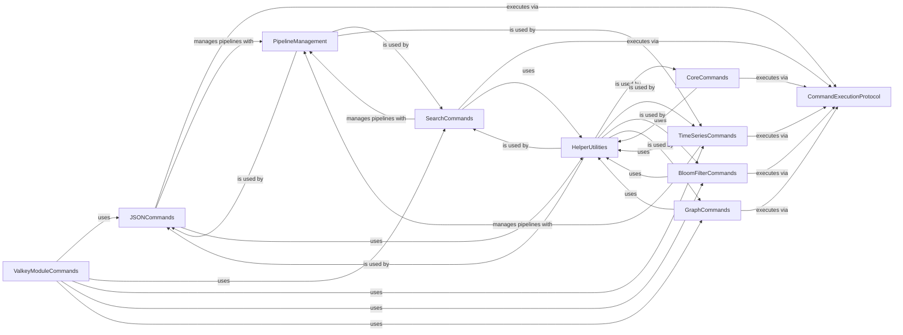

## Component Details

This component overview details the 'Valkey Command Interfaces' subsystem, which provides a structured way to interact with Valkey's core functionalities and various modules like JSON, Search, TimeSeries, Probabilistic Data Structures, and Graph. It defines the command classes, their responsibilities, and how they interact with underlying execution protocols, helper utilities, and pipeline management to facilitate efficient and robust communication with the Valkey server.

### ValkeyModuleCommands
This component provides an interface to various Valkey modules, acting as a dispatcher to module-specific command classes like JSON, Search, TimeSeries, and various Bloom filter implementations. It simplifies access to extended functionalities beyond core Valkey commands.

**Related Classes/Methods**:

- <a href="https://github.com/valkey-io/valkey-py/blob/master/valkey/commands/valkeymodules.py#L4-L83" target="_blank" rel="noopener noreferrer">`valkey.commands.valkeymodules.ValkeyModuleCommands` (4:83)</a>
- <a href="https://github.com/valkey-io/valkey-py/blob/master/valkey/commands/valkeymodules.py#L86-L103" target="_blank" rel="noopener noreferrer">`valkey.commands.valkeymodules.AsyncValkeyModuleCommands` (86:103)</a>

### CoreCommands
This component encapsulates the fundamental Valkey commands, categorized into Access Control List (ACL), Management, and Basic Key operations. It provides methods for administrative tasks, client management, server configuration, and basic data manipulation.

**Related Classes/Methods**:

- <a href="https://github.com/valkey-io/valkey-py/blob/master/valkey/commands/core.py#L55-L386" target="_blank" rel="noopener noreferrer">`valkey.commands.core.ACLCommands` (55:386)</a>
- <a href="https://github.com/valkey-io/valkey-py/blob/master/valkey/commands/core.py#L392-L1383" target="_blank" rel="noopener noreferrer">`valkey.commands.core.ManagementCommands` (392:1383)</a>
- <a href="https://github.com/valkey-io/valkey-py/blob/master/valkey/commands/core.py#L1386-L1434" target="_blank" rel="noopener noreferrer">`valkey.commands.core.AsyncManagementCommands` (1386:1434)</a>
- <a href="https://github.com/valkey-io/valkey-py/blob/master/valkey/commands/core.py#L1549-L2541" target="_blank" rel="noopener noreferrer">`valkey.commands.core.BasicKeyCommands` (1549:2541)</a>
- <a href="https://github.com/valkey-io/valkey-py/blob/master/valkey/commands/core.py#L2544-L2561" target="_blank" rel="noopener noreferrer">`valkey.commands.core.AsyncBasicKeyCommands` (2544:2561)</a>
- <a href="https://github.com/valkey-io/valkey-py/blob/master/valkey/commands/core.py#L6302-L6316" target="_blank" rel="noopener noreferrer">`valkey.commands.core.CoreCommands` (6302:6316)</a>
- <a href="https://github.com/valkey-io/valkey-py/blob/master/valkey/commands/core.py#L6319-L6333" target="_blank" rel="noopener noreferrer">`valkey.commands.core.AsyncCoreCommands` (6319:6333)</a>

### JSONCommands
This component provides a comprehensive set of commands for interacting with JSON data stored in Valkey. It supports operations such as appending, getting, setting, deleting, and manipulating JSON objects and arrays.

**Related Classes/Methods**:

- <a href="https://github.com/valkey-io/valkey-py/blob/master/valkey/commands/json/commands.py#L13-L431" target="_blank" rel="noopener noreferrer">`valkey.commands.json.commands.JSONCommands` (13:431)</a>
- `valkey.commands.json.JSON` (full file reference)

### SearchCommands
This component offers functionalities for full-text search and indexing within Valkey. It includes methods for adding documents, executing search queries, performing aggregations, and managing search indexes.

**Related Classes/Methods**:

- <a href="https://github.com/valkey-io/valkey-py/blob/master/valkey/commands/search/commands.py#L63-L895" target="_blank" rel="noopener noreferrer">`valkey.commands.search.commands.SearchCommands` (63:895)</a>
- <a href="https://github.com/valkey-io/valkey-py/blob/master/valkey/commands/search/commands.py#L898-L1117" target="_blank" rel="noopener noreferrer">`valkey.commands.search.commands.AsyncSearchCommands` (898:1117)</a>
- `valkey.commands.search.Search` (full file reference)
- `valkey.commands.search.AsyncSearch` (full file reference)

### TimeSeriesCommands
This component is dedicated to managing time-series data in Valkey. It provides commands for creating time series, adding data points, incrementing/decrementing values, and querying data within specified time ranges.

**Related Classes/Methods**:

- <a href="https://github.com/valkey-io/valkey-py/blob/master/valkey/commands/timeseries/commands.py#L25-L905" target="_blank" rel="noopener noreferrer">`valkey.commands.timeseries.commands.TimeSeriesCommands` (25:905)</a>
- `valkey.commands.timeseries.TimeSeries` (full file reference)

### BloomFilterCommands
This component provides interfaces for various probabilistic data structures, including Bloom filters (BF), Cuckoo filters (CF), Count-Min sketches (CMS), Top-K, and T-Digest. These structures are used for approximate membership queries and data sketching.

**Related Classes/Methods**:

- `valkey.commands.bf.BFBloom` (full file reference)
- `valkey.commands.bf.CFBloom` (full file reference)
- `valkey.commands.bf.CMSBloom` (full file reference)
- `valkey.commands.bf.TOPKBloom` (full file reference)
- `valkey.commands.bf.TDigestBloom` (full file reference)

### GraphCommands
This component enables interaction with ValkeyGraph, providing functionalities for executing Cypher queries, managing graph schemas, and performing graph-specific operations like adding nodes and relationships.

**Related Classes/Methods**:

- <a href="https://github.com/valkey-io/valkey-py/blob/master/valkey/commands/graph/commands.py#L18-L215" target="_blank" rel="noopener noreferrer">`valkey.commands.graph.commands.GraphCommands` (18:215)</a>
- <a href="https://github.com/valkey-io/valkey-py/blob/master/valkey/commands/graph/commands.py#L218-L313" target="_blank" rel="noopener noreferrer">`valkey.commands.graph.commands.AsyncGraphCommands` (218:313)</a>
- `valkey.commands.graph.Graph` (full file reference)
- `valkey.commands.graph.AsyncGraph` (full file reference)

### CommandExecutionProtocol
This component defines the fundamental interface for executing commands against the Valkey server. It serves as a core abstraction that various command classes rely on to send commands and receive responses.

**Related Classes/Methods**:

- <a href="https://github.com/valkey-io/valkey-py/blob/master/valkey/typing.py#L59-L59" target="_blank" rel="noopener noreferrer">`valkey.typing.CommandsProtocol.execute_command` (59:59)</a>

### HelperUtilities
This component provides a collection of utility functions that assist in command processing, data conversion, and string manipulation across different Valkey command modules.

**Related Classes/Methods**:

- <a href="https://github.com/valkey-io/valkey-py/blob/master/valkey/commands/helpers.py#L10-L24" target="_blank" rel="noopener noreferrer">`valkey.commands.helpers.list_or_args` (10:24)</a>
- <a href="https://github.com/valkey-io/valkey-py/blob/master/valkey/commands/helpers.py#L27-L32" target="_blank" rel="noopener noreferrer">`valkey.commands.helpers.nativestr` (27:32)</a>
- <a href="https://github.com/valkey-io/valkey-py/blob/master/valkey/commands/helpers.py#L171-L175" target="_blank" rel="noopener noreferrer">`valkey.commands.helpers.get_protocol_version` (171:175)</a>
- <a href="https://github.com/valkey-io/valkey-py/blob/master/valkey/commands/helpers.py#L105-L111" target="_blank" rel="noopener noreferrer">`valkey.commands.helpers.random_string` (105:111)</a>
- <a href="https://github.com/valkey-io/valkey-py/blob/master/valkey/commands/helpers.py#L144-L168" target="_blank" rel="noopener noreferrer">`valkey.commands.helpers.stringify_param_value` (144:168)</a>
- <a href="https://github.com/valkey-io/valkey-py/blob/master/valkey/commands/helpers.py#L114-L131" target="_blank" rel="noopener noreferrer">`valkey.commands.helpers.quote_string` (114:131)</a>
- <a href="https://github.com/valkey-io/valkey-py/blob/master/valkey/commands/helpers.py#L82-L102" target="_blank" rel="noopener noreferrer">`valkey.commands.helpers.parse_to_dict` (82:102)</a>

### PipelineManagement
This component handles the creation and management of pipelines for various Valkey modules, allowing for batching of commands to improve performance.

**Related Classes/Methods**:

- `valkey.commands.json.ClusterPipeline` (full file reference)
- `valkey.commands.json.Pipeline` (full file reference)
- `valkey.commands.search.Pipeline` (full file reference)
- `valkey.commands.search.AsyncPipeline` (full file reference)
- `valkey.commands.timeseries.ClusterPipeline` (full file reference)
- `valkey.commands.timeseries.Pipeline` (full file reference)

### [FAQ](https://github.com/CodeBoarding/GeneratedOnBoardings/tree/main?tab=readme-ov-file#faq)