```mermaid
graph LR
    Valkey_Client_Core["Valkey Client Core"]
    Valkey_Cluster_Sentinel_Clients["Valkey Cluster & Sentinel Clients"]
    Connection_Pooling["Connection & Pooling"]
    Valkey_Command_Interfaces["Valkey Command Interfaces"]
    Protocol_Data_Serialization["Protocol & Data Serialization"]
    Resilience_Error_Handling["Resilience & Error Handling"]
    Distributed_Locking["Distributed Locking"]
    Security_Performance_Enhancements["Security & Performance Enhancements"]
    Development_Testing_Utilities["Development & Testing Utilities"]
    Valkey_Client_Core -- "uses" --> Connection_Pooling
    Valkey_Client_Core -- "uses" --> Protocol_Data_Serialization
    Valkey_Client_Core -- "executes" --> Valkey_Command_Interfaces
    Valkey_Client_Core -- "uses" --> Distributed_Locking
    Valkey_Client_Core -- "interacts with" --> Resilience_Error_Handling
    Valkey_Client_Core -- "uses" --> Security_Performance_Enhancements
    Valkey_Cluster_Sentinel_Clients -- "uses" --> Connection_Pooling
    Valkey_Cluster_Sentinel_Clients -- "uses" --> Protocol_Data_Serialization
    Valkey_Cluster_Sentinel_Clients -- "executes" --> Valkey_Command_Interfaces
    Valkey_Cluster_Sentinel_Clients -- "interacts with" --> Resilience_Error_Handling
    Valkey_Cluster_Sentinel_Clients -- "uses" --> Security_Performance_Enhancements
    Connection_Pooling -- "uses" --> Protocol_Data_Serialization
    Connection_Pooling -- "uses" --> Security_Performance_Enhancements
    Connection_Pooling -- "interacts with" --> Resilience_Error_Handling
    Valkey_Command_Interfaces -- "are executed by" --> Valkey_Client_Core
    Valkey_Command_Interfaces -- "are executed by" --> Valkey_Cluster_Sentinel_Clients
    Protocol_Data_Serialization -- "depends on" --> Resilience_Error_Handling
    Distributed_Locking -- "depends on" --> Valkey_Client_Core
    Security_Performance_Enhancements -- "is used by" --> Connection_Pooling
    Security_Performance_Enhancements -- "is used by" --> Valkey_Client_Core
    Development_Testing_Utilities -- "interacts with" --> Valkey_Client_Core
    Development_Testing_Utilities -- "interacts with" --> Valkey_Cluster_Sentinel_Clients
    click Valkey_Client_Core href "https://github.com/CodeBoarding/GeneratedOnBoardings/blob/main/valkey-py/Valkey Client Core.md" "Details"
    click Valkey_Cluster_Sentinel_Clients href "https://github.com/CodeBoarding/GeneratedOnBoardings/blob/main/valkey-py/Valkey Cluster & Sentinel Clients.md" "Details"
    click Connection_Pooling href "https://github.com/CodeBoarding/GeneratedOnBoardings/blob/main/valkey-py/Connection & Pooling.md" "Details"
    click Valkey_Command_Interfaces href "https://github.com/CodeBoarding/GeneratedOnBoardings/blob/main/valkey-py/Valkey Command Interfaces.md" "Details"
    click Protocol_Data_Serialization href "https://github.com/CodeBoarding/GeneratedOnBoardings/blob/main/valkey-py/Protocol & Data Serialization.md" "Details"
    click Resilience_Error_Handling href "https://github.com/CodeBoarding/GeneratedOnBoardings/blob/main/valkey-py/Resilience & Error Handling.md" "Details"
    click Distributed_Locking href "https://github.com/CodeBoarding/GeneratedOnBoardings/blob/main/valkey-py/Distributed Locking.md" "Details"
    click Security_Performance_Enhancements href "https://github.com/CodeBoarding/GeneratedOnBoardings/blob/main/valkey-py/Security & Performance Enhancements.md" "Details"
    click Development_Testing_Utilities href "https://github.com/CodeBoarding/GeneratedOnBoardings/blob/main/valkey-py/Development & Testing Utilities.md" "Details"
```

## Component Details

The `valkey-py` library provides a comprehensive client for interacting with Valkey, supporting both synchronous and asynchronous operations, as well as specialized clients for Valkey Cluster and Sentinel environments. Its core functionality revolves around managing connections, encoding/decoding Valkey protocols, and exposing a rich set of Valkey commands, while also incorporating features for resilience, distributed locking, and performance optimization.

### Valkey Client Core
Provides the fundamental synchronous and asynchronous interfaces for interacting with Valkey, including basic commands, pipelining, PubSub, and monitoring. It serves as the primary entry point for most Valkey operations.

**Related Classes/Methods**:

- <a href="https://github.com/valkey-io/valkey-py/blob/master/valkey/client.py#L92-L619" target="_blank" rel="noopener noreferrer">`valkey-py.valkey.client.Valkey` (92:619)</a>
- <a href="https://github.com/valkey-io/valkey-py/blob/master/valkey/client.py#L1224-L1569" target="_blank" rel="noopener noreferrer">`valkey-py.valkey.client.Pipeline` (1224:1569)</a>
- <a href="https://github.com/valkey-io/valkey-py/blob/master/valkey/client.py#L692-L1182" target="_blank" rel="noopener noreferrer">`valkey-py.valkey.client.PubSub` (692:1182)</a>
- <a href="https://github.com/valkey-io/valkey-py/blob/master/valkey/client.py#L625-L689" target="_blank" rel="noopener noreferrer">`valkey-py.valkey.client.Monitor` (625:689)</a>
- <a href="https://github.com/valkey-io/valkey-py/blob/master/valkey/client.py#L61-L85" target="_blank" rel="noopener noreferrer">`valkey-py.valkey.client.CaseInsensitiveDict` (61:85)</a>
- <a href="https://github.com/valkey-io/valkey-py/blob/master/valkey/asyncio/client.py#L101-L694" target="_blank" rel="noopener noreferrer">`valkey-py.valkey.asyncio.client.Valkey` (101:694)</a>
- <a href="https://github.com/valkey-io/valkey-py/blob/master/valkey/asyncio/client.py#L1229-L1595" target="_blank" rel="noopener noreferrer">`valkey-py.valkey.asyncio.client.Pipeline` (1229:1595)</a>
- <a href="https://github.com/valkey-io/valkey-py/blob/master/valkey/asyncio/client.py#L782-L1209" target="_blank" rel="noopener noreferrer">`valkey-py.valkey.asyncio.client.PubSub` (782:1209)</a>
- <a href="https://github.com/valkey-io/valkey-py/blob/master/valkey/asyncio/client.py#L709-L779" target="_blank" rel="noopener noreferrer">`valkey-py.valkey.asyncio.client.Monitor` (709:779)</a>

### Valkey Cluster & Sentinel Clients
Manages connections and operations for both synchronous and asynchronous clients within Valkey Cluster and Sentinel environments, handling node discovery, slot mapping, failover, and intelligent command routing.

**Related Classes/Methods**:

- <a href="https://github.com/valkey-io/valkey-py/blob/master/valkey/cluster.py#L452-L1276" target="_blank" rel="noopener noreferrer">`valkey-py.valkey.cluster.ValkeyCluster` (452:1276)</a>
- <a href="https://github.com/valkey-io/valkey-py/blob/master/valkey/cluster.py#L1338-L1694" target="_blank" rel="noopener noreferrer">`valkey-py.valkey.cluster.NodesManager` (1338:1694)</a>
- <a href="https://github.com/valkey-io/valkey-py/blob/master/valkey/cluster.py#L1697-L1927" target="_blank" rel="noopener noreferrer">`valkey-py.valkey.cluster.ClusterPubSub` (1697:1927)</a>
- <a href="https://github.com/valkey-io/valkey-py/blob/master/valkey/cluster.py#L1930-L2361" target="_blank" rel="noopener noreferrer">`valkey-py.valkey.cluster.ClusterPipeline` (1930:2361)</a>
- <a href="https://github.com/valkey-io/valkey-py/blob/master/valkey/cluster.py#L1279-L1316" target="_blank" rel="noopener noreferrer">`valkey-py.valkey.cluster.ClusterNode` (1279:1316)</a>
- <a href="https://github.com/valkey-io/valkey-py/blob/master/valkey/asyncio/cluster.py#L99-L959" target="_blank" rel="noopener noreferrer">`valkey-py.valkey.asyncio.cluster.ValkeyCluster` (99:959)</a>
- <a href="https://github.com/valkey-io/valkey-py/blob/master/valkey/asyncio/cluster.py#L1145-L1442" target="_blank" rel="noopener noreferrer">`valkey-py.valkey.asyncio.cluster.NodesManager` (1145:1442)</a>
- <a href="https://github.com/valkey-io/valkey-py/blob/master/valkey/asyncio/cluster.py#L962-L1142" target="_blank" rel="noopener noreferrer">`valkey-py.valkey.asyncio.cluster.ClusterNode` (962:1142)</a>
- <a href="https://github.com/valkey-io/valkey-py/blob/master/valkey/asyncio/cluster.py#L1445-L1686" target="_blank" rel="noopener noreferrer">`valkey-py.valkey.asyncio.cluster.ClusterPipeline` (1445:1686)</a>
- <a href="https://github.com/valkey-io/valkey-py/blob/master/valkey/sentinel.py#L203-L406" target="_blank" rel="noopener noreferrer">`valkey-py.valkey.sentinel.Sentinel` (203:406)</a>
- <a href="https://github.com/valkey-io/valkey-py/blob/master/valkey/sentinel.py#L142-L200" target="_blank" rel="noopener noreferrer">`valkey-py.valkey.sentinel.SentinelConnectionPool` (142:200)</a>
- <a href="https://github.com/valkey-io/valkey-py/blob/master/valkey/sentinel.py#L25-L87" target="_blank" rel="noopener noreferrer">`valkey-py.valkey.sentinel.SentinelManagedConnection` (25:87)</a>
- <a href="https://github.com/valkey-io/valkey-py/blob/master/valkey/asyncio/sentinel.py#L176-L389" target="_blank" rel="noopener noreferrer">`valkey-py.valkey.asyncio.sentinel.Sentinel` (176:389)</a>
- <a href="https://github.com/valkey-io/valkey-py/blob/master/valkey/asyncio/sentinel.py#L105-L173" target="_blank" rel="noopener noreferrer">`valkey-py.valkey.asyncio.sentinel.SentinelConnectionPool` (105:173)</a>
- <a href="https://github.com/valkey-io/valkey-py/blob/master/valkey/asyncio/sentinel.py#L31-L98" target="_blank" rel="noopener noreferrer">`valkey-py.valkey.asyncio.sentinel.SentinelManagedConnection` (31:98)</a>

### Connection & Pooling
Manages the underlying synchronous and asynchronous network connections to Valkey servers, including connection pooling, SSL/TLS encryption, Unix domain socket support, and health checks.

**Related Classes/Methods**:

- <a href="https://github.com/valkey-io/valkey-py/blob/master/valkey/connection.py#L952-L1235" target="_blank" rel="noopener noreferrer">`valkey-py.valkey.connection.ConnectionPool` (952:1235)</a>
- <a href="https://github.com/valkey-io/valkey-py/blob/master/valkey/connection.py#L147-L676" target="_blank" rel="noopener noreferrer">`valkey-py.valkey.connection.AbstractConnection` (147:676)</a>
- <a href="https://github.com/valkey-io/valkey-py/blob/master/valkey/connection.py#L679-L746" target="_blank" rel="noopener noreferrer">`valkey-py.valkey.connection.Connection` (679:746)</a>
- <a href="https://github.com/valkey-io/valkey-py/blob/master/valkey/connection.py#L749-L915" target="_blank" rel="noopener noreferrer">`valkey-py.valkey.connection.SSLConnection` (749:915)</a>
- <a href="https://github.com/valkey-io/valkey-py/blob/master/valkey/connection.py#L918-L946" target="_blank" rel="noopener noreferrer">`valkey-py.valkey.connection.UnixDomainSocketConnection` (918:946)</a>
- <a href="https://github.com/valkey-io/valkey-py/blob/master/valkey/connection.py#L1238-L1395" target="_blank" rel="noopener noreferrer">`valkey-py.valkey.connection.BlockingConnectionPool` (1238:1395)</a>
- <a href="https://github.com/valkey-io/valkey-py/blob/master/valkey/asyncio/connection.py#L969-L1174" target="_blank" rel="noopener noreferrer">`valkey-py.valkey.asyncio.connection.ConnectionPool` (969:1174)</a>
- <a href="https://github.com/valkey-io/valkey-py/blob/master/valkey/asyncio/connection.py#L99-L745" target="_blank" rel="noopener noreferrer">`valkey-py.valkey.asyncio.connection.AbstractConnection` (99:745)</a>
- <a href="https://github.com/valkey-io/valkey-py/blob/master/valkey/asyncio/connection.py#L748-L802" target="_blank" rel="noopener noreferrer">`valkey-py.valkey.asyncio.connection.Connection` (748:802)</a>
- <a href="https://github.com/valkey-io/valkey-py/blob/master/valkey/asyncio/connection.py#L805-L866" target="_blank" rel="noopener noreferrer">`valkey-py.valkey.asyncio.connection.SSLConnection` (805:866)</a>
- <a href="https://github.com/valkey-io/valkey-py/blob/master/valkey/asyncio/connection.py#L932-L953" target="_blank" rel="noopener noreferrer">`valkey-py.valkey.asyncio.connection.UnixDomainSocketConnection` (932:953)</a>
- <a href="https://github.com/valkey-io/valkey-py/blob/master/valkey/asyncio/connection.py#L1177-L1249" target="_blank" rel="noopener noreferrer">`valkey-py.valkey.asyncio.connection.BlockingConnectionPool` (1177:1249)</a>

### Valkey Command Interfaces
Implements the various standard Valkey commands and interfaces for interacting with Valkey modules (e.g., JSON, Search, TimeSeries, Probabilistic Data Structures, Graph). These classes provide the methods for interacting with Valkey data structures and extended functionalities.

**Related Classes/Methods**:

- <a href="https://github.com/valkey-io/valkey-py/blob/master/valkey/commands/core.py#L55-L386" target="_blank" rel="noopener noreferrer">`valkey-py.valkey.commands.core.ACLCommands` (55:386)</a>
- <a href="https://github.com/valkey-io/valkey-py/blob/master/valkey/commands/core.py#L392-L1383" target="_blank" rel="noopener noreferrer">`valkey-py.valkey.commands.core.ManagementCommands` (392:1383)</a>
- <a href="https://github.com/valkey-io/valkey-py/blob/master/valkey/commands/core.py#L1549-L2541" target="_blank" rel="noopener noreferrer">`valkey-py.valkey.commands.core.BasicKeyCommands` (1549:2541)</a>
- <a href="https://github.com/valkey-io/valkey-py/blob/master/valkey/commands/valkeymodules.py#L4-L83" target="_blank" rel="noopener noreferrer">`valkey-py.valkey.commands.valkeymodules.ValkeyModuleCommands` (4:83)</a>
- `valkey-py.valkey.commands.json.JSON` (full file reference)
- `valkey-py.valkey.commands.search.Search` (full file reference)
- `valkey-py.valkey.commands.timeseries.TimeSeries` (full file reference)
- `valkey-py.valkey.commands.bf.BFBloom` (full file reference)
- `valkey-py.valkey.commands.graph.Graph` (full file reference)
- <a href="https://github.com/valkey-io/valkey-py/blob/master/valkey/commands/core.py#L2544-L2561" target="_blank" rel="noopener noreferrer">`valkey-py.valkey.commands.core.AsyncBasicKeyCommands` (2544:2561)</a>
- `valkey-py.valkey.commands.search.AsyncSearch` (full file reference)
- `valkey-py.valkey.commands.graph.AsyncGraph` (full file reference)

### Protocol & Data Serialization
Responsible for encoding commands into the Valkey protocol format (RESP2, RESP3) and decoding responses received from the Valkey server. It also handles low-level socket buffer operations and URL parsing for connection strings.

**Related Classes/Methods**:

- <a href="https://github.com/valkey-io/valkey-py/blob/master/valkey/_parsers/encoders.py#L4-L44" target="_blank" rel="noopener noreferrer">`valkey-py.valkey._parsers.encoders.Encoder` (4:44)</a>
- <a href="https://github.com/valkey-io/valkey-py/blob/master/valkey/_parsers/socket.py#L29-L162" target="_blank" rel="noopener noreferrer">`valkey-py.valkey._parsers.socket.SocketBuffer` (29:162)</a>
- <a href="https://github.com/valkey-io/valkey-py/blob/master/valkey/_parsers/resp3.py#L12-L142" target="_blank" rel="noopener noreferrer">`valkey-py.valkey._parsers.resp3._RESP3Parser` (12:142)</a>
- <a href="https://github.com/valkey-io/valkey-py/blob/master/valkey/_parsers/resp2.py#L9-L68" target="_blank" rel="noopener noreferrer">`valkey-py.valkey._parsers.resp2._RESP2Parser` (9:68)</a>
- <a href="https://github.com/valkey-io/valkey-py/blob/master/valkey/_parsers/libvalkey.py#L35-L145" target="_blank" rel="noopener noreferrer">`valkey-py.valkey._parsers.libvalkey._LibvalkeyParser` (35:145)</a>
- <a href="https://github.com/valkey-io/valkey-py/blob/master/valkey/_parsers/base.py#L48-L93" target="_blank" rel="noopener noreferrer">`valkey-py.valkey._parsers.base.BaseParser` (48:93)</a>
- <a href="https://github.com/valkey-io/valkey-py/blob/master/valkey/_parsers/commands.py#L56-L170" target="_blank" rel="noopener noreferrer">`valkey-py.valkey._parsers.commands.CommandsParser` (56:170)</a>
- `valkey-py.valkey._parsers.helpers` (full file reference)
- `valkey-py.valkey._parsers.url_parser` (full file reference)
- `valkey-py.valkey.utils` (full file reference)

### Resilience & Error Handling
Provides mechanisms for retrying failed operations with configurable backoff strategies and defines custom exception classes for various error conditions, ensuring robust and structured error management.

**Related Classes/Methods**:

- <a href="https://github.com/valkey-io/valkey-py/blob/master/valkey/retry.py#L13-L70" target="_blank" rel="noopener noreferrer">`valkey-py.valkey.retry.Retry` (13:70)</a>
- <a href="https://github.com/valkey-io/valkey-py/blob/master/valkey/backoff.py#L38-L42" target="_blank" rel="noopener noreferrer">`valkey-py.valkey.backoff.NoBackoff` (38:42)</a>
- <a href="https://github.com/valkey-io/valkey-py/blob/master/valkey/backoff.py#L113-L114" target="_blank" rel="noopener noreferrer">`valkey-py.valkey.backoff.default_backoff` (113:114)</a>
- `valkey-py.valkey.exceptions` (full file reference)

### Distributed Locking
Implements distributed locking mechanisms for managing concurrent access to resources across multiple clients, ensuring atomicity and consistency in a distributed environment.

**Related Classes/Methods**:

- <a href="https://github.com/valkey-io/valkey-py/blob/master/valkey/lock.py#L11-L325" target="_blank" rel="noopener noreferrer">`valkey-py.valkey.lock.Lock` (11:325)</a>
- <a href="https://github.com/valkey-io/valkey-py/blob/master/valkey/asyncio/lock.py#L13-L313" target="_blank" rel="noopener noreferrer">`valkey-py.valkey.asyncio.lock.Lock` (13:313)</a>

### Security & Performance Enhancements
Handles Online Certificate Status Protocol (OCSP) verification for SSL/TLS connections to ensure certificate validity and implements a local cache for frequently accessed data to reduce network round trips and improve performance.

**Related Classes/Methods**:

- <a href="https://github.com/valkey-io/valkey-py/blob/master/valkey/ocsp.py#L169-L307" target="_blank" rel="noopener noreferrer">`valkey-py.valkey.ocsp.OCSPVerifier` (169:307)</a>
- `valkey-py.valkey.ocsp` (full file reference)
- <a href="https://github.com/valkey-io/valkey-py/blob/master/valkey/_cache.py#L199-L385" target="_blank" rel="noopener noreferrer">`valkey-py.valkey._cache._LocalCache` (199:385)</a>

### Development & Testing Utilities
Contains scripts and modules for benchmarking the performance of Valkey operations and defines high-level development tasks such as environment setup, linting, and test execution.

**Related Classes/Methods**:

- `valkey-py.benchmarks.basic_operations` (full file reference)
- <a href="https://github.com/valkey-io/valkey-py/blob/master/benchmarks/command_packer_benchmark.py#L6-L37" target="_blank" rel="noopener noreferrer">`valkey-py.benchmarks.command_packer_benchmark.StringJoiningConnection` (6:37)</a>
- <a href="https://github.com/valkey-io/valkey-py/blob/master/benchmarks/command_packer_benchmark.py#L40-L77" target="_blank" rel="noopener noreferrer">`valkey-py.benchmarks.command_packer_benchmark.ListJoiningConnection` (40:77)</a>
- `valkey-py.benchmarks.cluster_async_pipeline` (full file reference)
- <a href="https://github.com/valkey-io/valkey-py/blob/master/benchmarks/base.py#L9-L44" target="_blank" rel="noopener noreferrer">`valkey-py.benchmarks.base.Benchmark` (9:44)</a>
- `valkey-py.benchmarks.cluster_async` (full file reference)
- <a href="https://github.com/valkey-io/valkey-py/blob/master/tasks.py#L13-L17" target="_blank" rel="noopener noreferrer">`valkey-py.tasks:devenv` (13:17)</a>
- <a href="https://github.com/valkey-io/valkey-py/blob/master/tasks.py#L38-L41" target="_blank" rel="noopener noreferrer">`valkey-py.tasks:all_tests` (38:41)</a>
- <a href="https://github.com/valkey-io/valkey-py/blob/master/tasks.py#L45-L51" target="_blank" rel="noopener noreferrer">`valkey-py.tasks:tests` (45:51)</a>

### [FAQ](https://github.com/CodeBoarding/GeneratedOnBoardings/tree/main?tab=readme-ov-file#faq)